# 1.福农萨摩亚

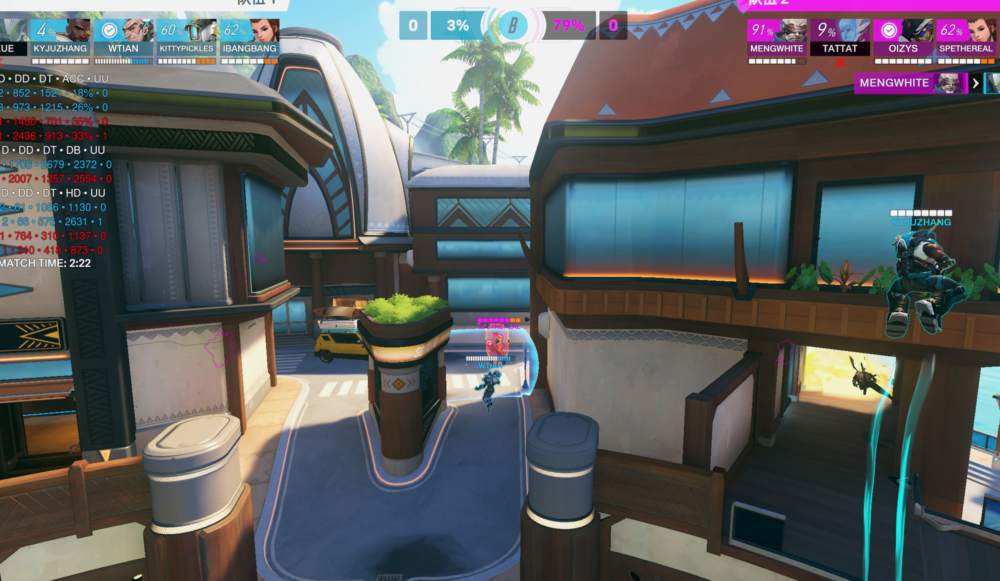

这波小锤要去帮76，但是得等猩猩一起，要提前沟通一下，对面西格玛阵容是要压前点的，一个炖鸡如果到不了掩体后的话要再抉择一下

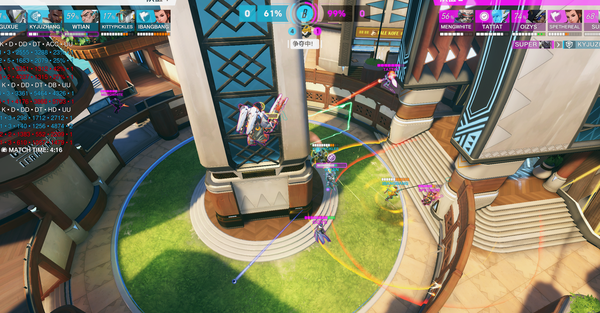

交叠甲之前抉择一下，虽然禁疗，但是堡垒有坐还没结束，对面4人在有返场空间，可以卡着中间柱子和他们打，规避堡垒第一波输出

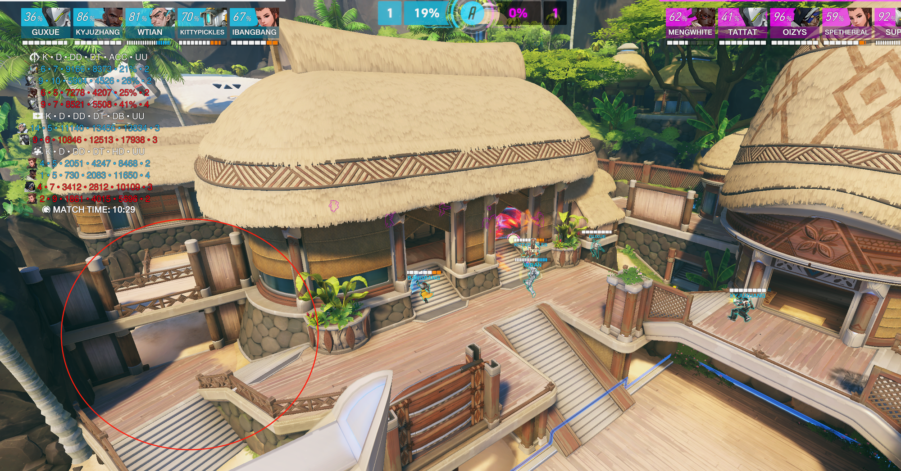

这张图一直在说，如果被堵门要有人拉侧线解堵门，分担点压力，不然就所有人绕，特别是打这种抱团的，堡垒一旦交了坐，从侧面走对面必定就在面前不远打输出，抓人很容易。从之前好几次就开始说了这个问题，昨天在打的时候也开麦说了，但是也没人去走

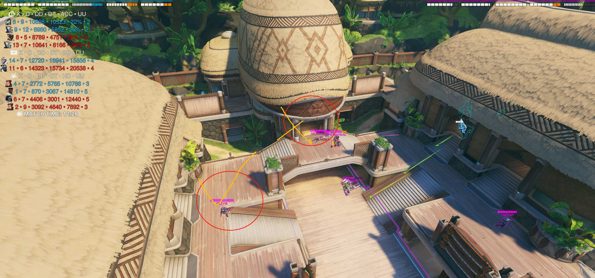

小锤单人卡这个门是卡不住的，猩猩后跳对面准备压的时候直接不回头的炖鸡往后走，不用去卡门

# 2.宗师队萨摩亚（分每人视角）

### 源

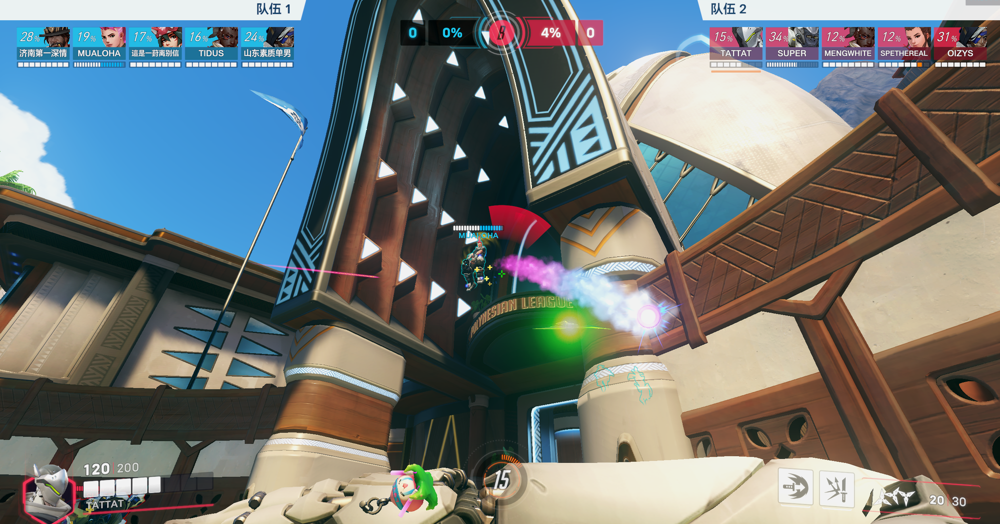

第一波被麦克雷手雷命中120血，对面毛妹在中能的情况下交炮下跳，会被秒，第一时间s后撤

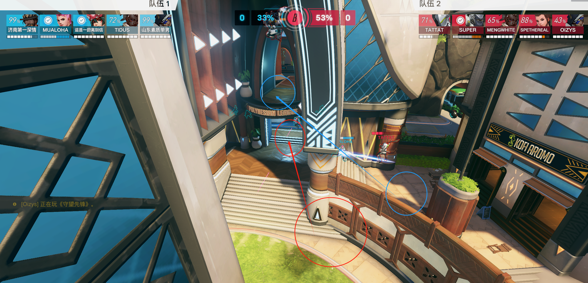

这波也是一样，没找好位置，爬墙s失误，建议按照图这么卡位，保证自己和对面之间始终拥有一个掩体，爬起来一个左键就能下去不会吃到伤害，又能起到骚扰作用

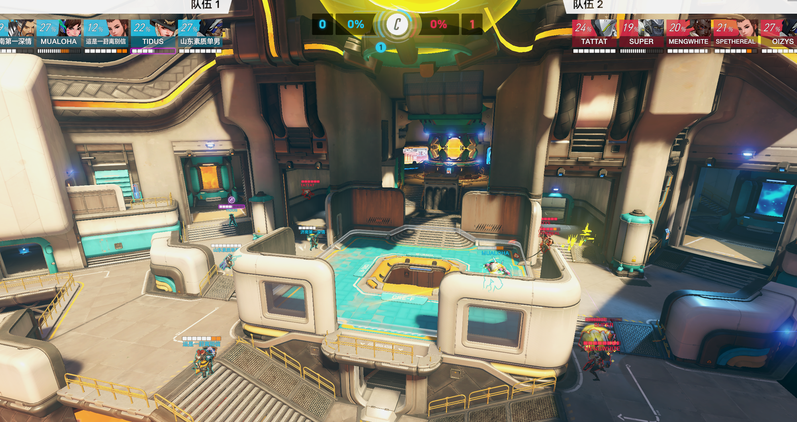

第一波tp失误先不说，这波自己一个人压前点，没有猩猩隔奶的情况下，安娜看着半藏，除非三镖头+s不然杀不掉的，这里交S必死，需要侧边持续骚扰，s用来保命/猩猩第二波跳隔开奶之后跟集火

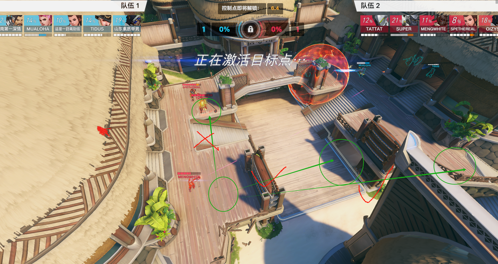

第三张图开局被禁疗点燃，吃到奶之后，别往正面去，源在还没跟集火+对面全员后点的时候，就是需要拉侧线烦人+落位，拉到桥上只能说给对面送

### 索

第一波到对面索第二波返场的时候都是纯在梦游，不知道自己该站哪里，一点伤害没给

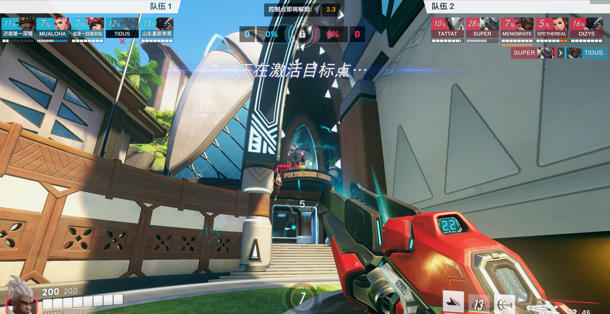

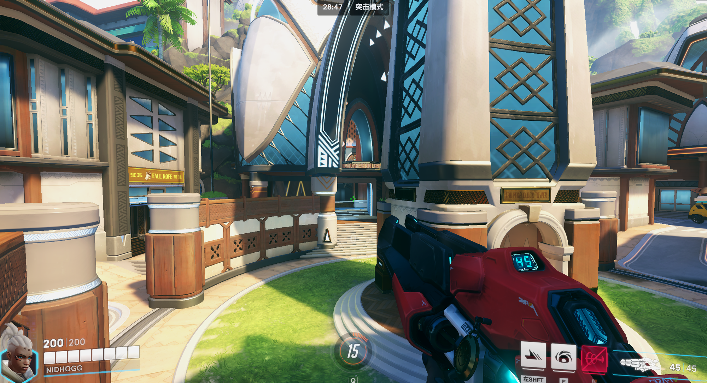

你在下边给不到伤害就上楼，已知对面喜欢拉二楼，我也上个小二楼，且对面带麦和索，没充能又秒不掉，直接放心上二楼输出，返场的时候能量还不如对面第一波死掉了索

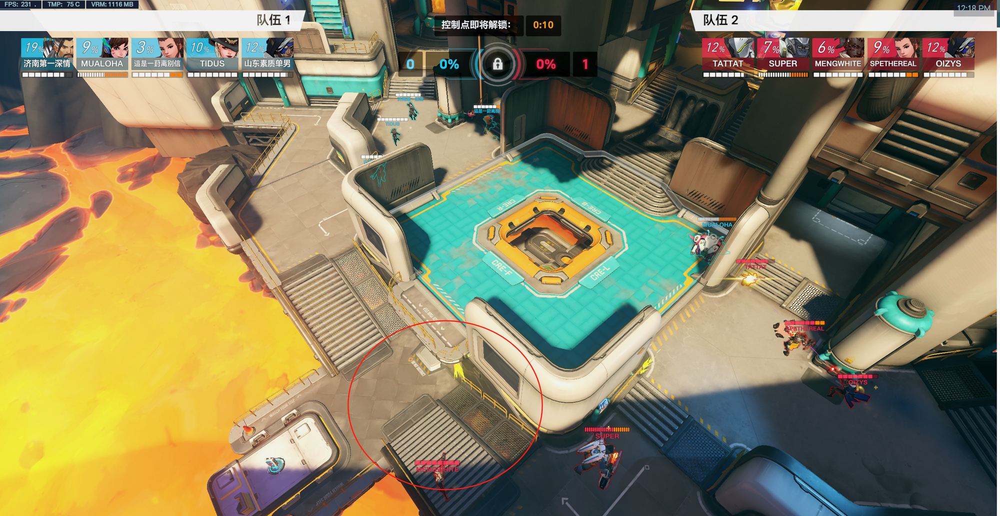

意义不明的站位×2，对着掩体一阵输出，之后充能归零，给个干扰弹逼个位置就没了？，不行的话你拉正面交小锤多保你下拿dva充能抽枪后排都行，这站位真没看懂像这周正面满能，队员有标， 拉出来就能抽一枪，没中都没事，之后这枪蓄满能量最后在正面还没超到人甚至练小锤盾都没打到，这段你等的时间都够你攒第二个满能了

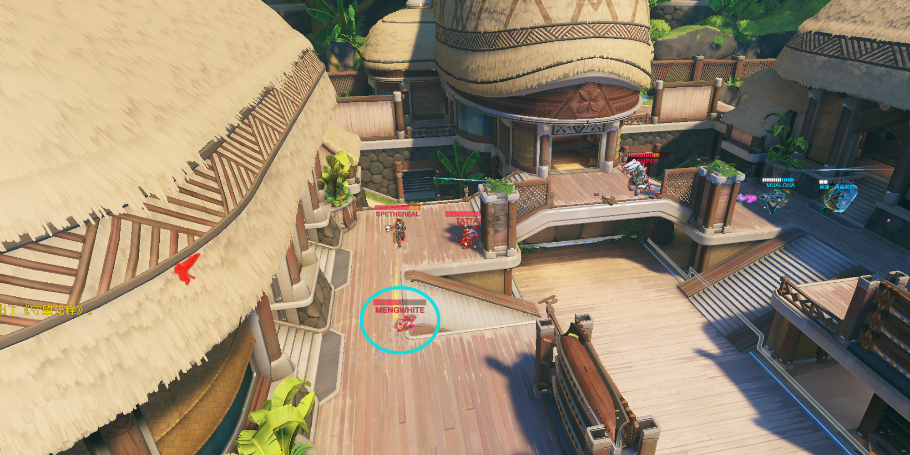

你还120血，安娜刚看着你，你一个滑铲到左边，视野受限，还奶不到，还没发给对面后排压力，不懂什么意思

之后就是被压，猩猩反跳，你跟着要么超不到人，要么猛打毛妹盾给对面送能量

总评：啥用没有，抽不到人，给对面送能量，送头全占了，要不玩个托比昂，不容易死而且炮台比你有用点

### 小锤

奶完猩猩，这个位置不好好卡着，对面万一跳下来，你还能一个飞锤抽走，拉扯下位置炖鸡向后，你卡后面一个人看不到，一个被动蹭不到，你不如玩个和尚在那挂奶球说不定还能抽到两下人，就只会在那发牌，发完牌就梦游

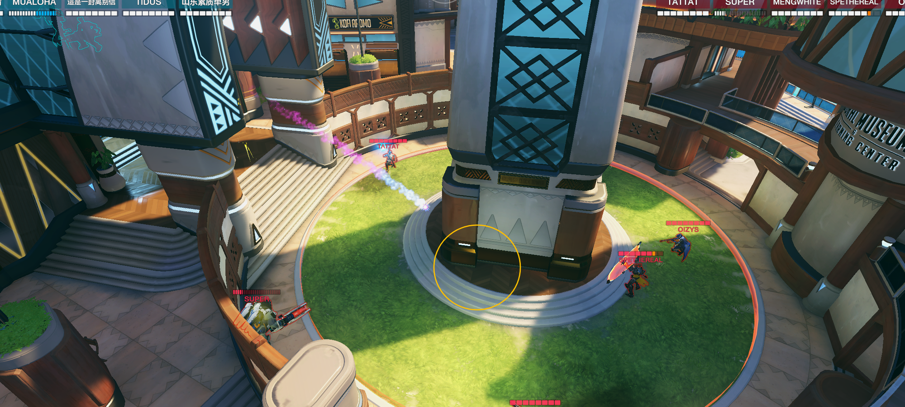

我不知道这样举个b盾有什么用，视野里一个队员没有，就举个b盾在那看

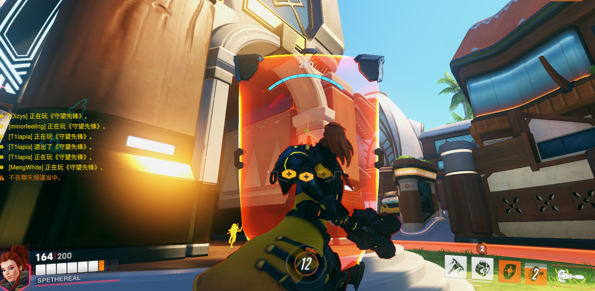

毛妹想拉到后排脸上直接锤走，T有击退抗性打不远，不要等到顶到脸上才想着抡一锤之后击退举盾后撤

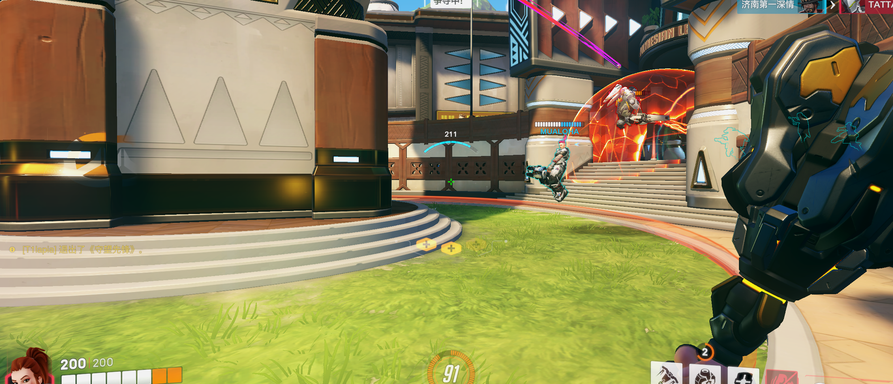

对面小锤有接T压力，就得站在c旁边，你没有接T压力，可以拉到侧线和源一起去骚扰锤一两下，手上有炖鸡转身就回掩体后了，不是在正面举盾之后盾被打的快碎之后缩回掩体

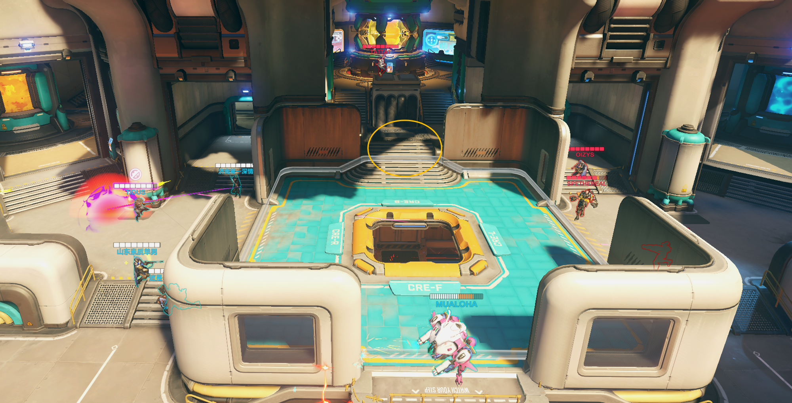

而且举盾看人也不是这么看的，你把盾卡在掩体里，用第三人称视角去看人，不是举个盾站路中间去看人抽飞锤

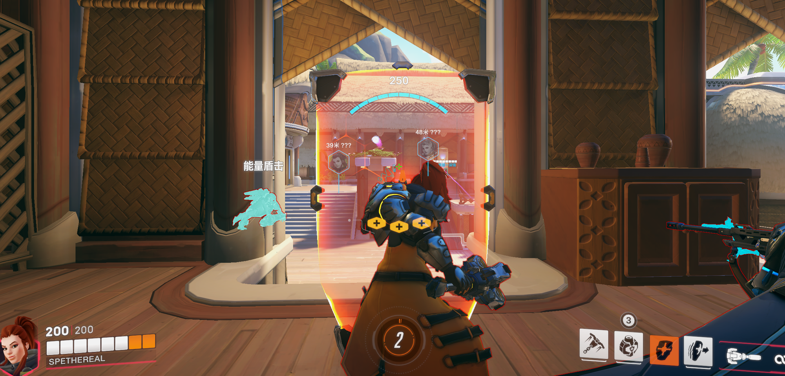

很多毫无意义的举盾站大马路看人

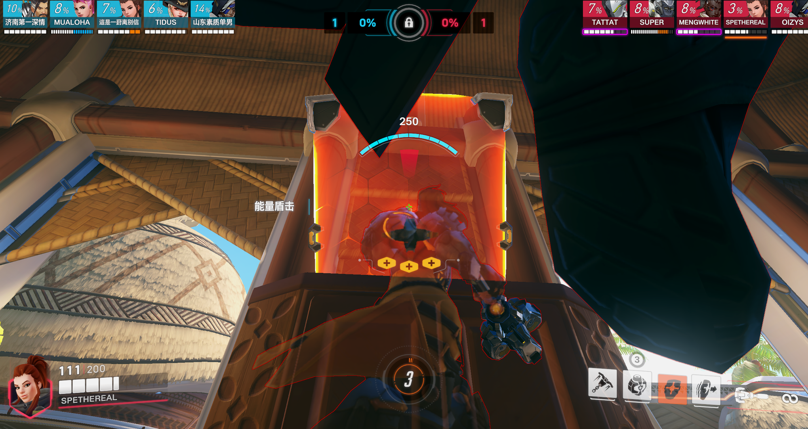

看天举盾

带着源和索在猩猩不在正面的时候赶去顶高能毛和双枪，真不怕死啊

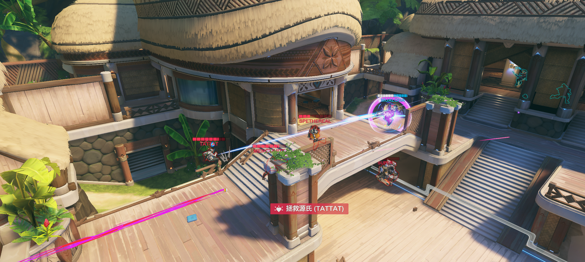

小锤总评：最不需要操作的英雄玩的也没什么脑子，乌龟打法，激进可以看沙耶，稳健可以看冷撒，skewed，我是没见过厉害的小锤这么玩的，小锤很简单，多看第一视角就学会了，站位，飞锤怎么交，该打谁跟谁，说实话小锤这么玩不如玩个莫伊拉雾子，奶还更多

另外两张纯平推先不说了

## 训练赛总结

之前靠着T和枪辅的强度打赢一些弱队别太给自己当回事了，OW本来就是比短板的游戏，OW2更放大短板，那如果中飞也知道我们猩猩厉害，专门接猩猩，给super限制住了，那也就像今天一样无解，没有先手击杀的索，站位激进的源，梦游的小锤，难不成指望一个安娜全部杀完？

这次约说是锻炼心态，也是要让你们看看自己到底在高水平对局下是个什么个样子，说实话我第一次在复盘和看你们打的时候这么急。

守望先锋这游戏是最不可能突然觉醒的游戏，我之前大一白金T，到之后大二快结束才上的39，一是因为我电脑从60升级到144，二是我觉得自己很菜，所以天天看联赛枪第一视角，一天练枪快三小时，之后rank，我也天天被骂，被骂就该懂得提升自己，如果真的觉得接受不了，强度太高直接说，不想打不想练的话我也能上，其他人也不比你们差，自己多反思，多练习。