## 1.萨摩亚

#### 第一张小图

这是对面的tp

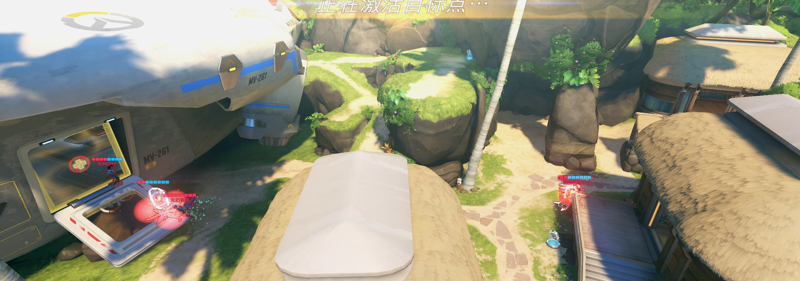

这是我们的tp

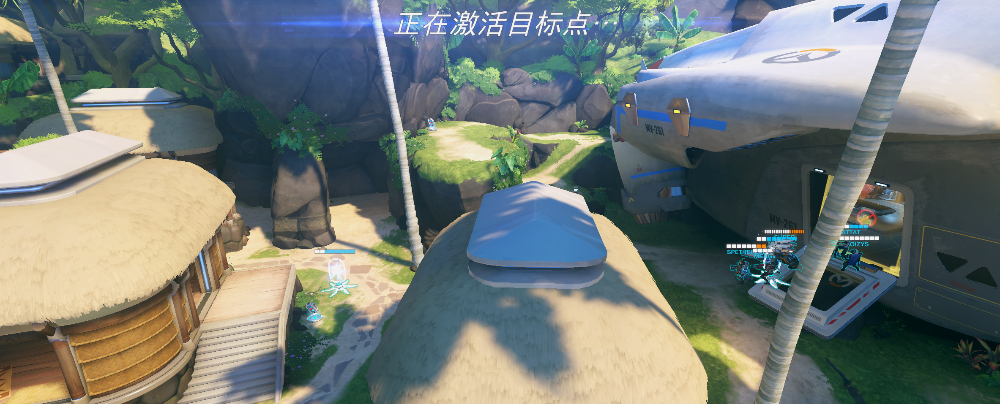

同一时间暂停截图，tp1是比对面慢一点上门，2是传送门比对面少了个身位，细节可以优化一下

第一波团

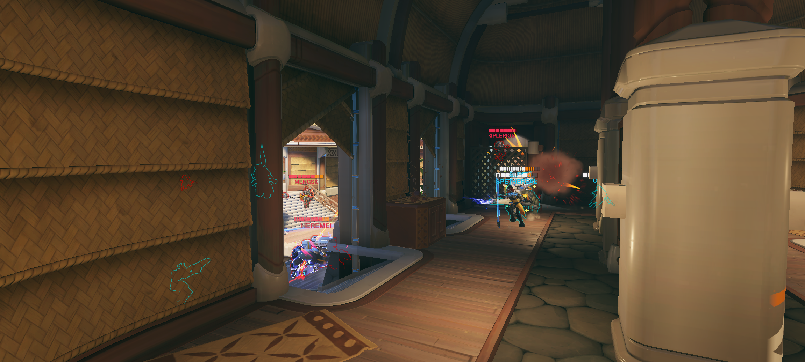

没人意识到狂鼠绕后偷掉安娜，正面没主奶情况下还在做卡门没有后撤，小锤抡不到人也蹭不了被动

第二波团

1.带小锤桡侧很好，但是没停住枪打醒对面激素猩猩

2.残局的时候没有做三人抱团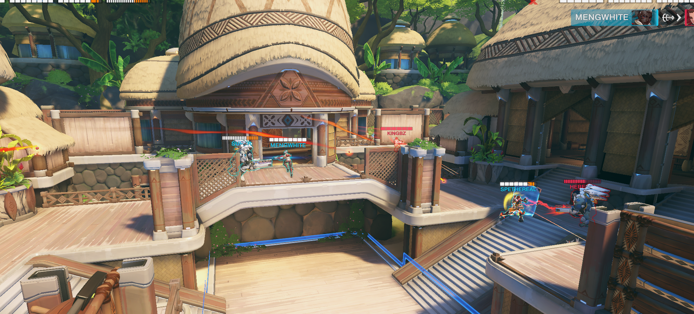

第三波返场团

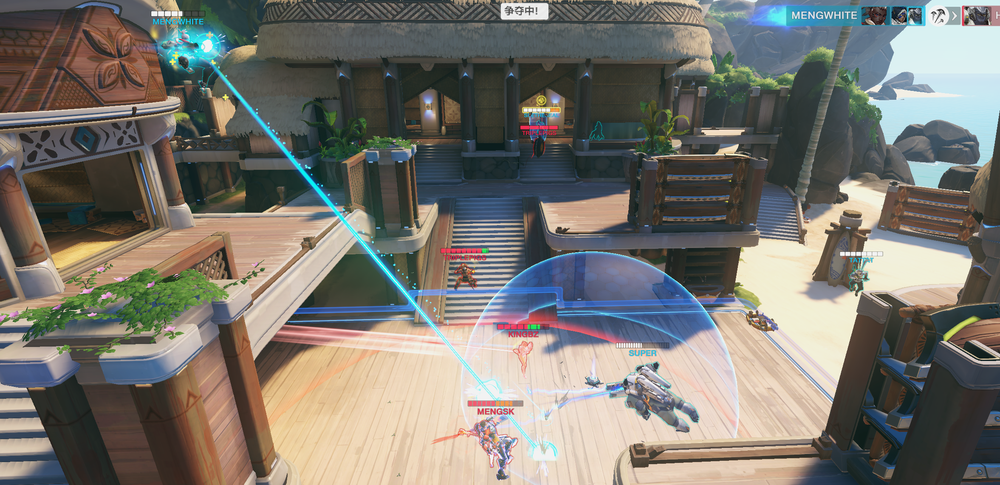

前三后二脱节厉害，这时候轮胎到双辅脸上应该做抉择，必死一个安娜没打就果断卖，调整角度炖鸡近点开大帮正面，不应该举盾等着被炸尝试保人a

第四波团

走右边外场后排被禁疗三个，起跳时源距离远，换后排比对面慢

这是我跑图考虑欠缺了，外场低台确实有容易被禁疗风险，下次可以尝试下走内场，有掩体，除了视野比较受限之外是不错的返场路线

最后一波

也是狂鼠绕后偷掉安娜，前排血线扛不住

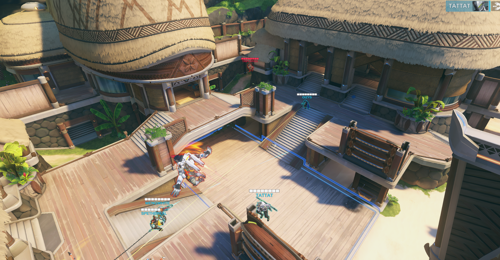

#### 第二张小图

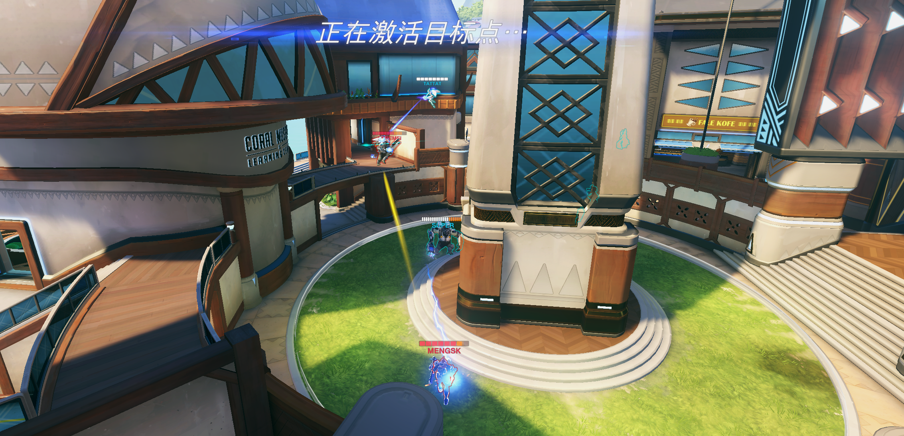

对面如果走正面的话，可以学一下对面猩猩的站位，要是没有飞的就很难针对到这个地方，对面如果要拉到点里打就会失位容易被集火

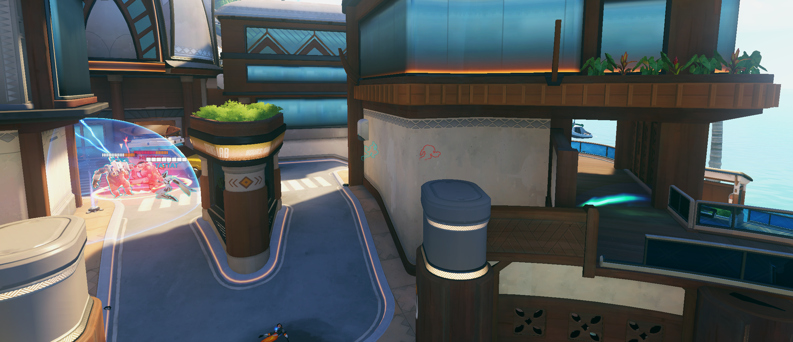

问了队友能不能抓狂鼠没人回应，雾子自己去但抓送了

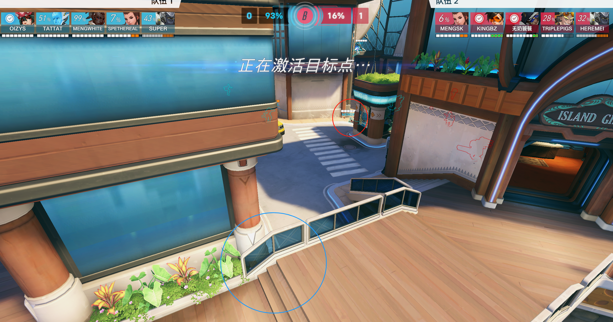

返场团索意义不明的滑铲向前打猩猩，没人观测到正面闪光不在可能绕后，后排小锤雾子没有接猩猩能力，对面直接激素猩猩加闪光补伤害被收完

下一波返场团

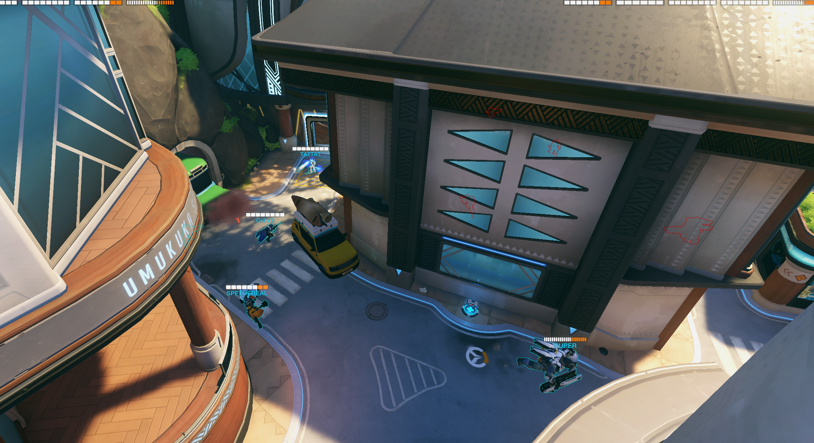

想抓个狂鼠四个人走左边，索被雷炸死，echo跑了，双辅被猩猩卡住，正面又没奶，让echo单绕就行，其他人跟猩猩走走正面，对面就一个炸弹，其他没技能，我们三个技能快好不怕对面的

之后再下一波

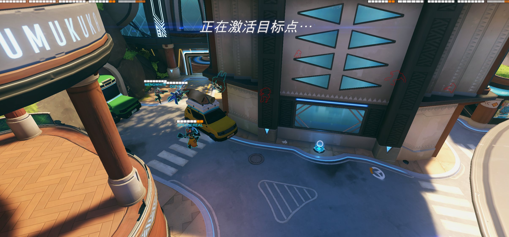

T也失智了，也跟着往里走，前跳之后对面猩猩过来扣个罩子，狂鼠猛灌伤害

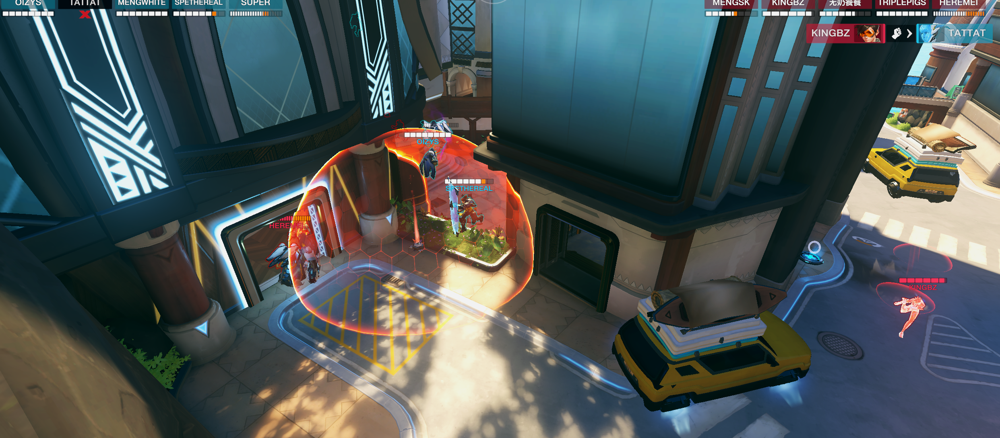

#### 第三张小图

之后咱打猩猩这套这张图可以不用去高台，咱就拉外场，因为拉高台的话是因为原来那套主的是抱团接人，放狗打的是拉开集火，比较不一样，所以之后咱打放狗还是走外场，给安娜小锤更多空间来拉扯

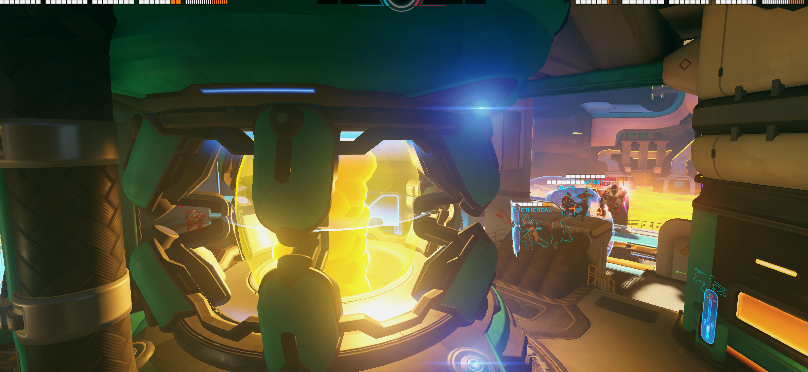

被绕怕了小锤很谨慎，但是忘了本职工作，飞锤猩猩，不让猩猩过来拍罩子

第二波返场团

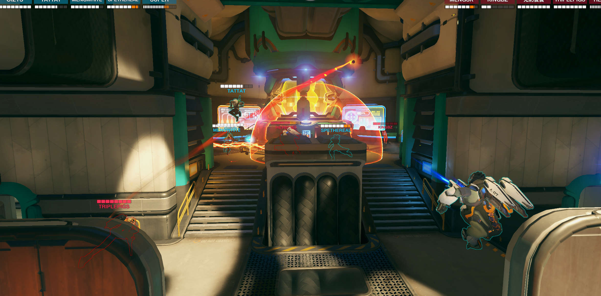

盾击向前想锤闪光结果进罩子下到半血，狂鼠侧面一炮秒

第三波返场团

核心换后排，但是对面前排比我们灵活，这是要考虑一个点，怎么打集火才能比对面换后排效率高，而不是说我们后排死完了对面还好好的，打中飞尤其要这么想

这场萨摩亚总体就是，后排被跳烂了，换后排不如对面，没有打出拿长短枪的先手击杀和高效集火，甚至先手击杀不如人狂鼠。