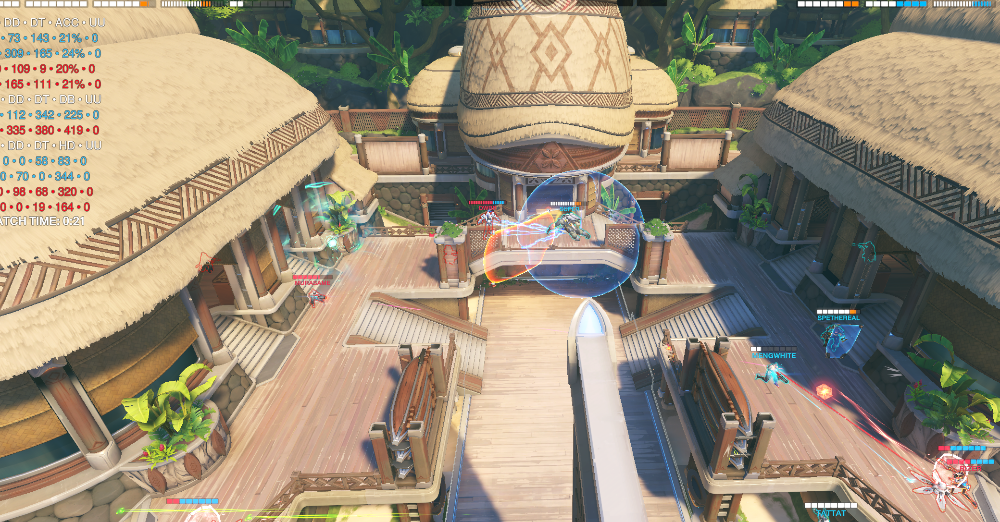
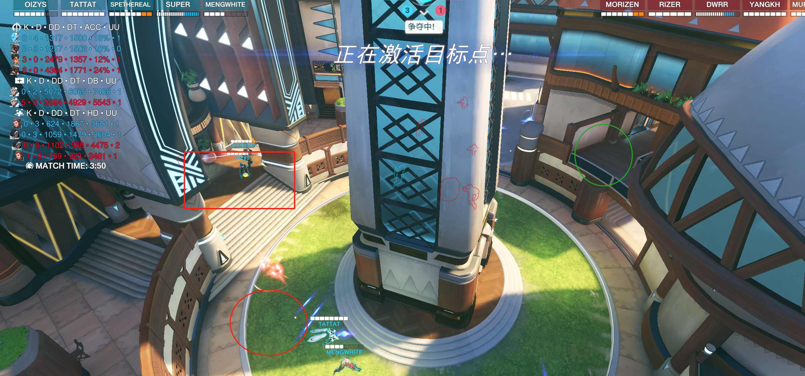
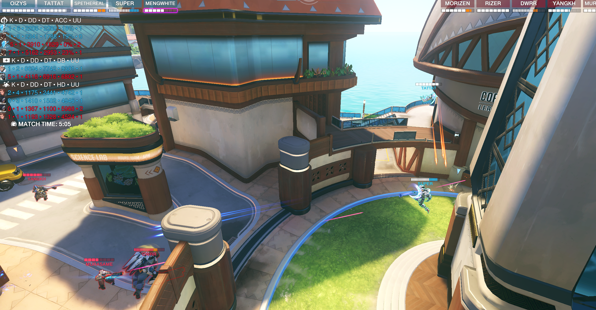
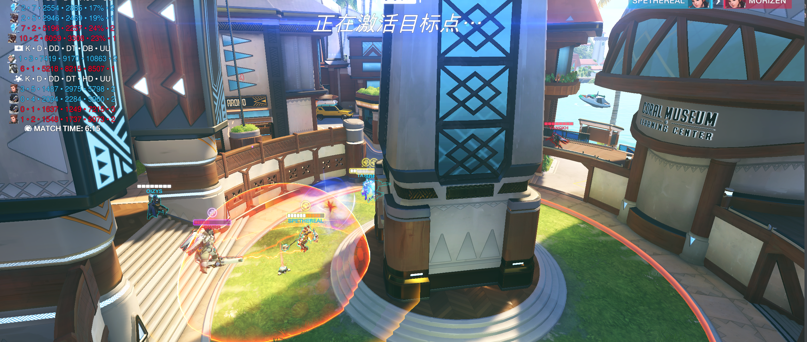
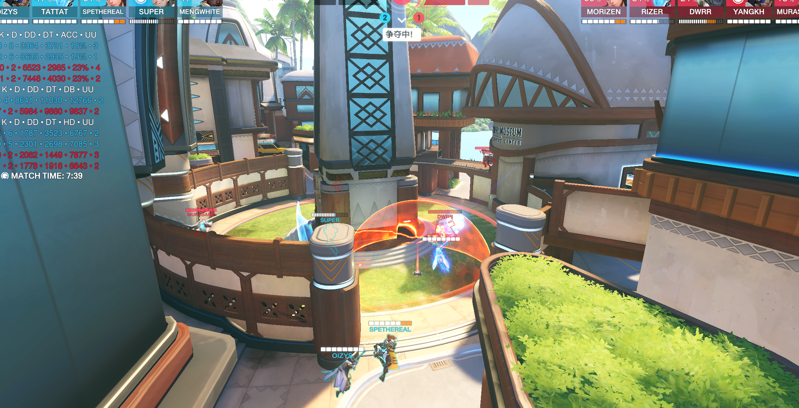
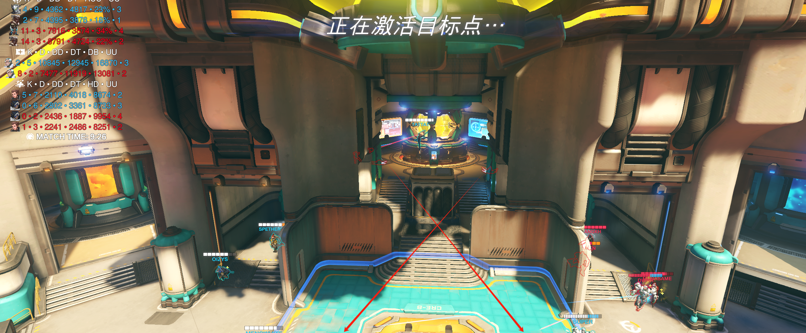

# 1.萨摩亚

第一波过于保守，也是没有人注意观测到侧面阿三绕后，同时没有人帮猩猩分担下正面压力

猩猩打的过于保守，在第一张图对面阿三也喜欢单绕的情况下，可以选择更为激进的顶后排卡盾

小锤在这种情况下有两种选择，安娜挂后且对面没狗，可以选择1当枪的保镖，2在西格玛盾外帮猩猩顶正面

这时对面抱团，虽然索掉了其实还可以打，源的话单绕感觉外场进场速度很慢，之后可以尝试走走内场侧面帮猩猩，也容易跟集火，外场让长枪拉，如果这波源在猩猩旁边，对面正面两个残，安娜瓶子又砸后排，猩猩有跳源有s，阿三130多血，西格玛160，源s50+猩猩小跳+拳80+猩猩电几下，源+几镖完全能收掉

这场的注意力很多时候大伙都在阿三身上，没有很好的跟到后排集火，像对面这种后三抱团，阿三单走，我们可以直接给T上点压力，T的石头，吸一些技能交完之后，消耗下盾量就可以扑后排或者直接集火前排了，并且阿三有门的时候找阿三是没用的，一下就跑了，会被白白拉扯

这个第一波玩西格玛阵容我们站位有问题，双c需要把枪线拉开，由于echo机动性高，可以站在绿圈位置，并且对面很难打到你，在西格玛对位的时候你还能从背后打西格玛给super分担压力

遇到对面还是这样并且带了闪光，对于后排的保护一定是很及时的，所以可以西格玛对位+骚扰出优势之后，靠着echo激光强吃前排，并且如果对面也带西格玛的话，索如果对自己自信的话可以换个天王老子来帮忙破盾

打西格玛我们优势很大，super对位+我们侧线伤害足够都快给对面西格玛爆了，但是小锤被粘炸弹炸死两个有点幽默，被粘之后站住不懂，告诉队友远离即可

像这种情况，西格玛肯定是卡正面的，echo就在西格玛另一侧帮助西格玛补侧面输出，就是站在我视角这个位置，飞的时候不要暴露在两条枪线及以上的视角内

返场团，这个索开大滑铲向前挺吓人的，还好有换掉不然战犯了，这波较多了，echo的变身可以扣下来的，对面场上就残血小锤，禁疗猩猩还有个安娜，叠甲完全可以打赢。

这波返场团也是，没有做好沟通，激素rank给法，打比赛不能说以为要往右边去找安娜就给，一定要在之前做好沟通说激素echo去先杀安娜，并且echo的激光给的太急，猩猩还3/4血就给，打不出斩杀，并且安娜那位置不找之后就是后排三人禁疗，被激素猩猩一波穿

第二波阿三位置，只能给这两个地方威胁，源可以不用去找，卡着右边门板在旁边骚扰，帮super分担下正面火力，还没交门之前，小锤注意下位置，如果tp了就飞锤锤走之后拉开身位就行

今天打中飞，这张图可以用这套西格玛，但是注意技能释放时机，super今天包括后面几张图有好几波抬空，到时候可以多抉择下，并且要开大前需要喊出来跟队友沟通