# 1.萨摩亚

第一波过于保守，也是没有人注意观测到侧面阿三绕后，同时没有人帮猩猩分担下正面压力

猩猩打的过于保守，在第一张图对面阿三也喜欢单绕的情况下，可以选择更为激进的顶后排卡盾

小锤在这种情况下有两种选择，安娜挂后且对面没狗，可以选择1当枪的保镖，2在西格玛盾外帮猩猩顶正面

这时对面抱团，虽然索掉了其实还可以打，源的话单绕感觉外场进场速度很慢，之后可以尝试走走内场侧面帮猩猩，也容易跟集火，外场让长枪拉，如果这波源在猩猩旁边，对面正面两个残，安娜瓶子又砸后排，猩猩有跳源有s，阿三130多血，西格玛160，源s50+猩猩小跳+拳80+猩猩电几下，源+几镖完全能收掉

这场的注意力很多时候大伙都在阿三身上，没有很好的跟到后排集火，像对面这种后三抱团，阿三单走，我们可以直接给T上点压力，T的石头，吸一些技能交完之后，消耗下盾量就可以扑后排或者直接集火前排了，并且阿三有门的时候找阿三是没用的，一下就跑了，会被白白拉扯

这个第一波玩西格玛阵容我们站位有问题，双c需要把枪线拉开，由于echo机动性高，可以站在绿圈位置，并且对面很难打到你，在西格玛对位的时候你还能从背后打西格玛给super分担压力

遇到对面还是这样并且带了闪光，对于后排的保护一定是很及时的，所以可以西格玛对位+骚扰出优势之后，靠着echo激光强吃前排，并且如果对面也带西格玛的话，索如果对自己自信的话可以换个天王老子来帮忙破盾

打西格玛我们优势很大，super对位+我们侧线伤害足够都快给对面西格玛爆了，但是小锤被粘炸弹炸死两个有点幽默，被粘之后站住不懂，告诉队友远离即可

像这种情况，西格玛肯定是卡正面的，echo就在西格玛另一侧帮助西格玛补侧面输出，就是站在我视角这个位置，飞的时候不要暴露在两条枪线及以上的视角内

返场团，这个索开大滑铲向前挺吓人的，还好有换掉不然战犯了，这波较多了，echo的变身可以扣下来的，对面场上就残血小锤，禁疗猩猩还有个安娜，叠甲完全可以打赢。

这波返场团也是，没有做好沟通，激素rank给法，打比赛不能说以为要往右边去找安娜就给，一定要在之前做好沟通说激素echo去先杀安娜，并且echo的激光给的太急，猩猩还3/4血就给，打不出斩杀，并且安娜那位置不找之后就是后排三人禁疗，被激素猩猩一波穿

第二波阿三位置，只能给这两个地方威胁，源可以不用去找，卡着右边门板在旁边骚扰，帮super分担下正面火力，还没交门之前，小锤注意下位置，如果tp了就飞锤锤走之后拉开身位就行

今天打中飞，这张图可以用这套西格玛，但是注意技能释放时机，super今天包括后面几张图有好几波抬空，到时候可以多抉择下，并且要开大前需要喊出来跟队友沟通

# 2.DJ老家

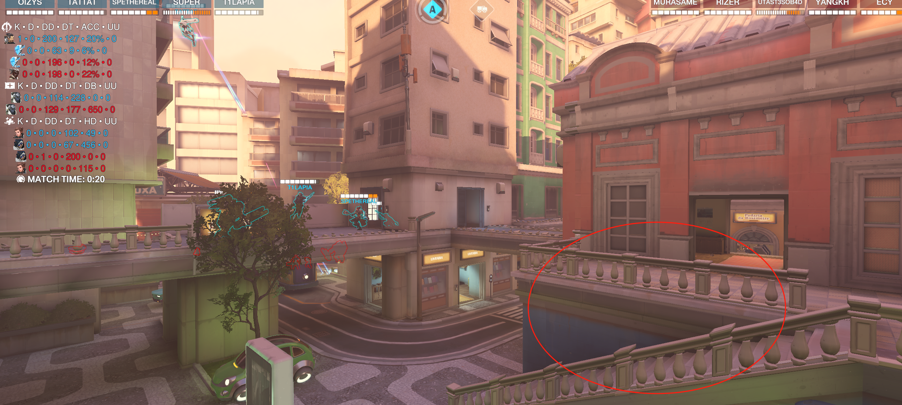

防守半藏站位我偏向把栏杆打掉站这个地方，给抽一两下给对面后排压力，也不会离对面太近被跳

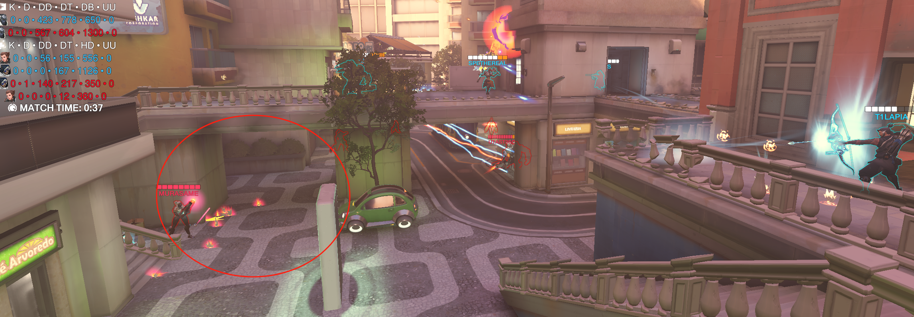

同时一定要注意盯防侧线对面枪拉过来

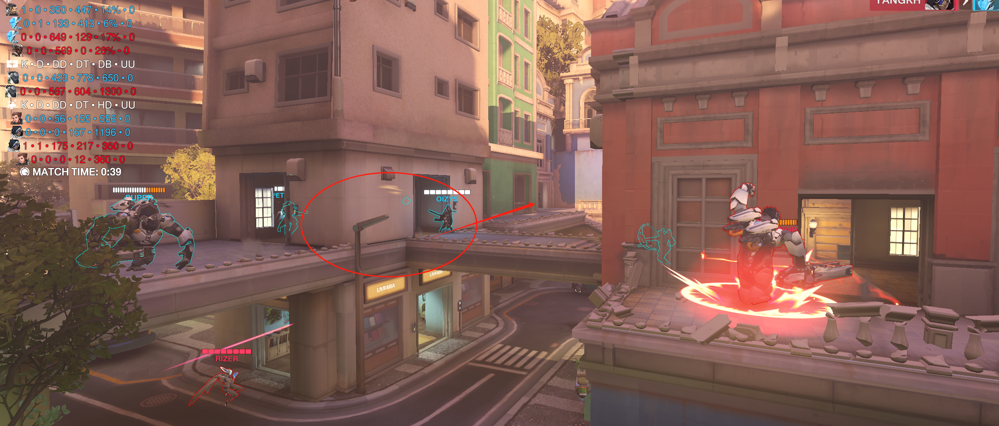

对面猩猩调过来之后双福应该立刻往后走，不然容易被卡小房间，信息交流还需要加强

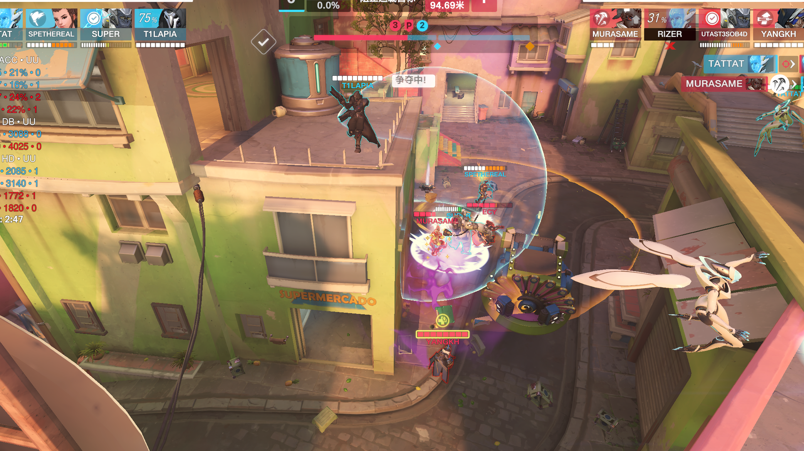

猩猩在后排找安娜这时候开大其实正面就三个脆皮并且有罩子的话可以扣一下，如果对面小锤开大我们反开，死神可以不用继续留着高台，三个脆皮并且有小锤猩猩可以直接跳下来收完

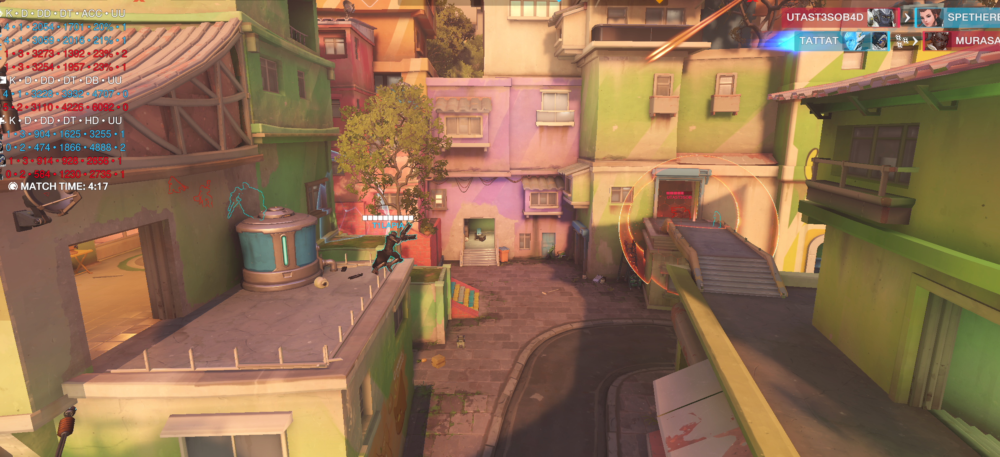

这波死神有点梦游了，想到对面会切后排，又从右边传到左边但是没跟正面集火感觉有点幽默了，如果后排站的靠前并且感觉猩猩跳，就可以站安娜小锤旁边当保镖，有激素对面后排就交给双狗

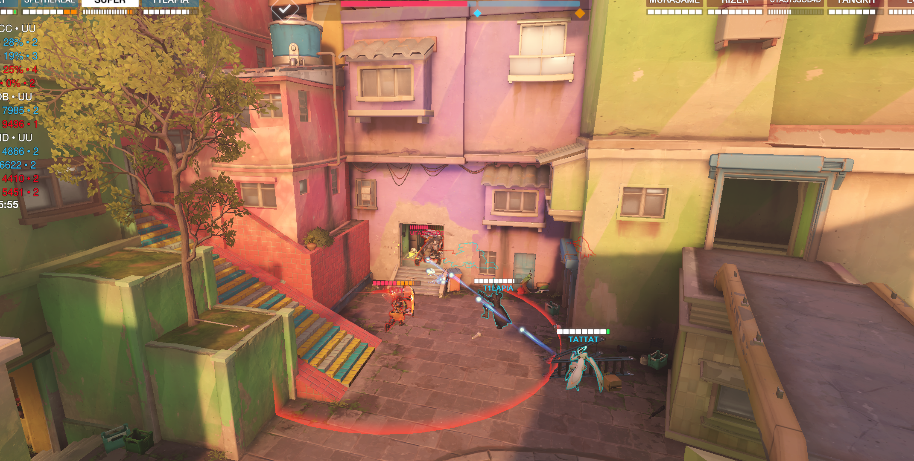

减少上头收人！见好就收

对面防守安娜纯挂后，考虑下这种思路，如果感觉奶能给到的话也是一种方法，不过放前面高台有点蠢

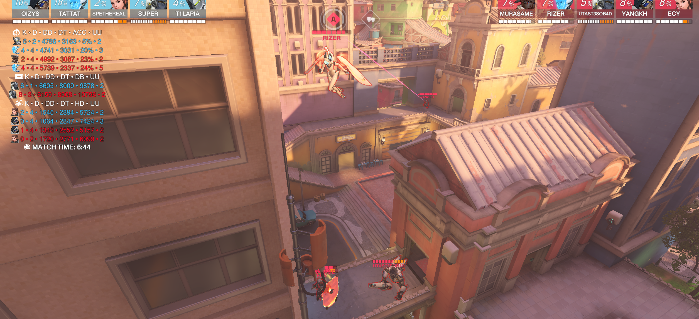

出门砸个定点雷（卡这个拐角）

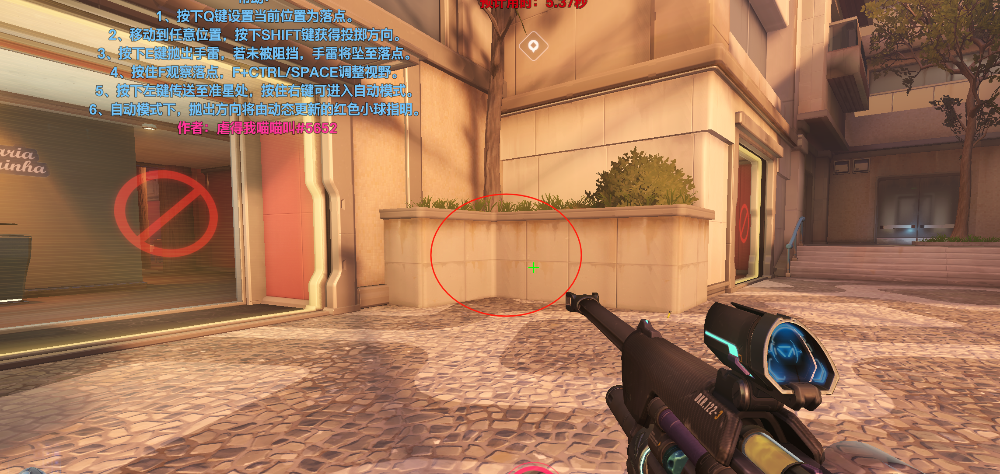

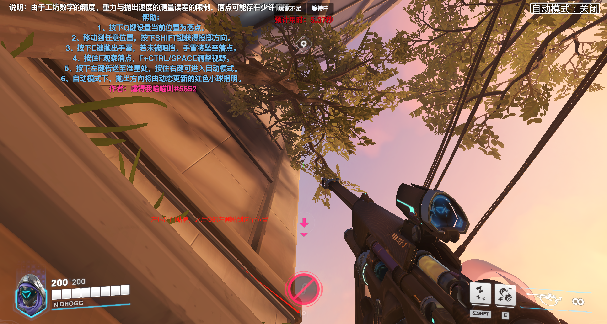

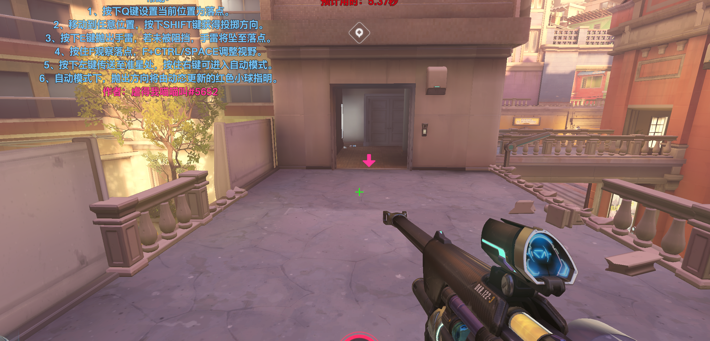

能落在高台门口，可以禁疗到里面的，需要5.3s，之后如果禁疗到猩猩打一波集火

代码DTV45，有空可以自己找找点位，多练下禁疗，增加成功率和熟练度（important！）

进攻思路应该是，猩猩不断蹭高台，echo在左右灌伤害之后后撤，希望是带死神，可以跟猩猩传送直接抓后面高台，源这张图对面这个阵容不大好发挥

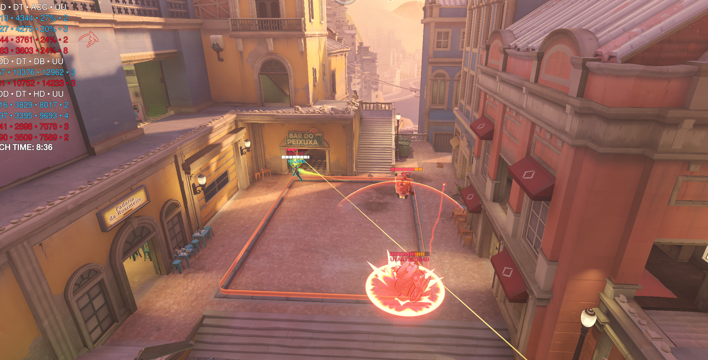

冒进上头了，进去吃不到资源会被集火，让猩猩牵扯一下后排之后等人叠甲刀即可

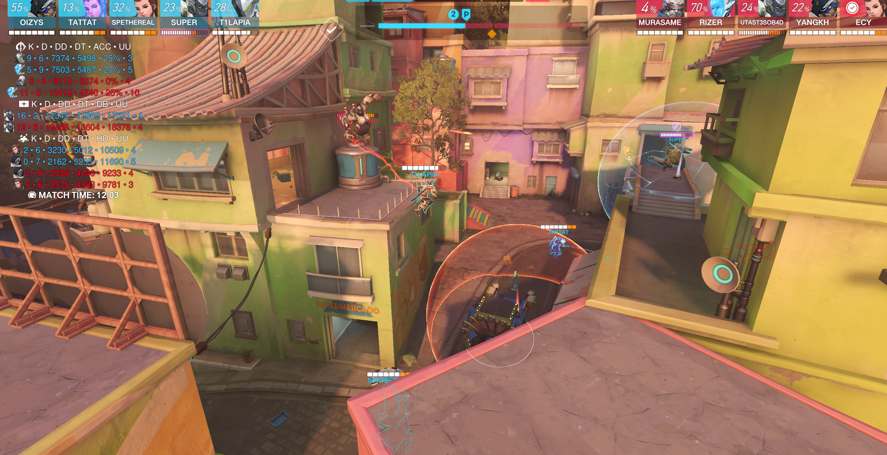

这边还是1对二楼控制不足，2变身交招问题，够不到人echo梦游，echo变身每次都会出现打不出变身大的情况，需要加强变身时机的判断，而且一变身就容易上头顶前面之后被打回去

最后一波是集火目标选择错了，而且源一个人带激素进去杀安娜小锤没人跟

# 3.国王大道

主要是2个出门定点瓶用来逼位置还有防守定点瓶，其他的之前也都讲过

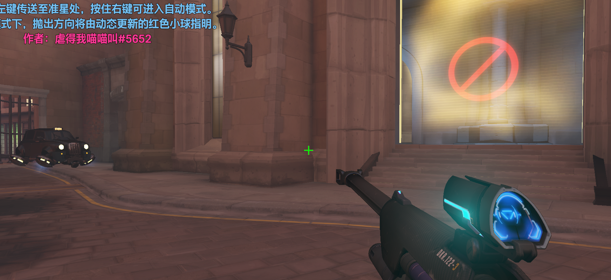

1.正面高台瓶子

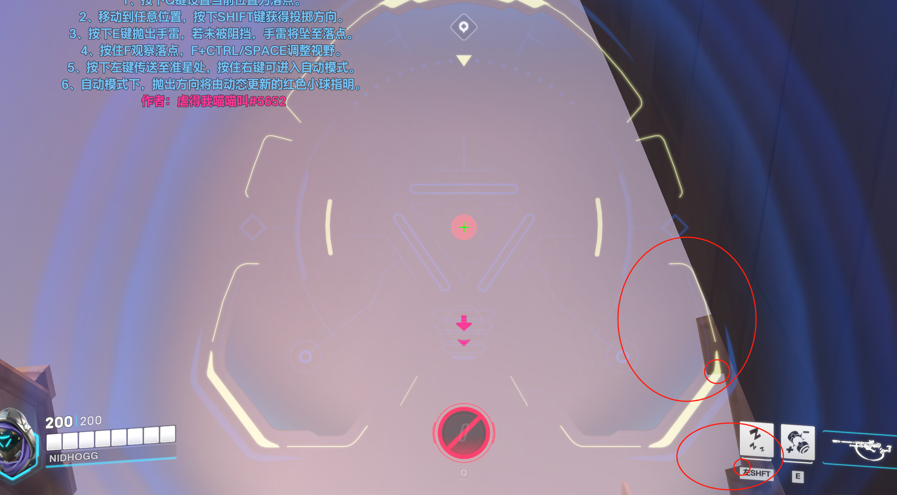

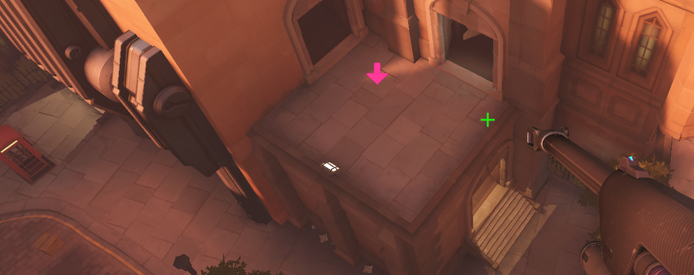

2.后面高台瓶子

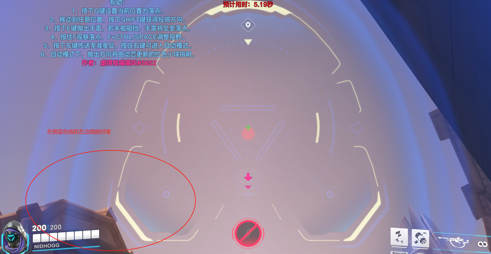

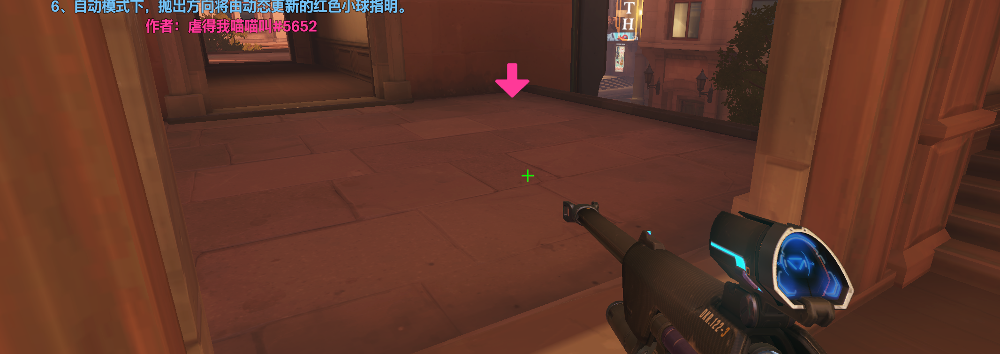

3.防守出门瓶子

这是后面二楼

准星在第上面的突起旁边，大招边缘贴着柱子即可，直接丢，还有5-4秒的时候丢，至少有十几的能量，直接落在进攻方门口

# 4.皇家赛道

昨天阵容问题很大，这张图带西格玛的话源没用，尽量选择猩猩+源，主打的跳

进攻二楼瓶

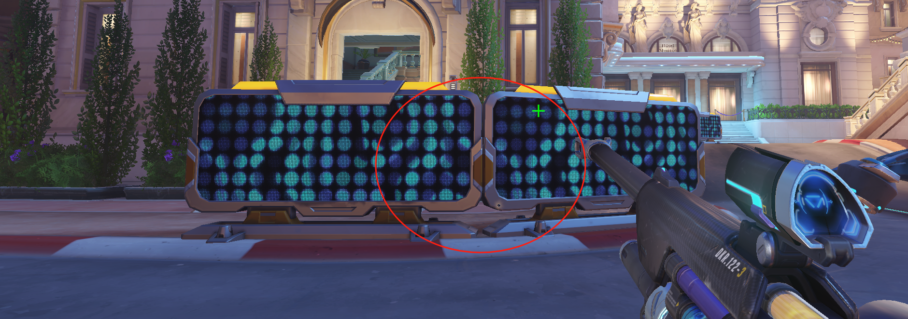

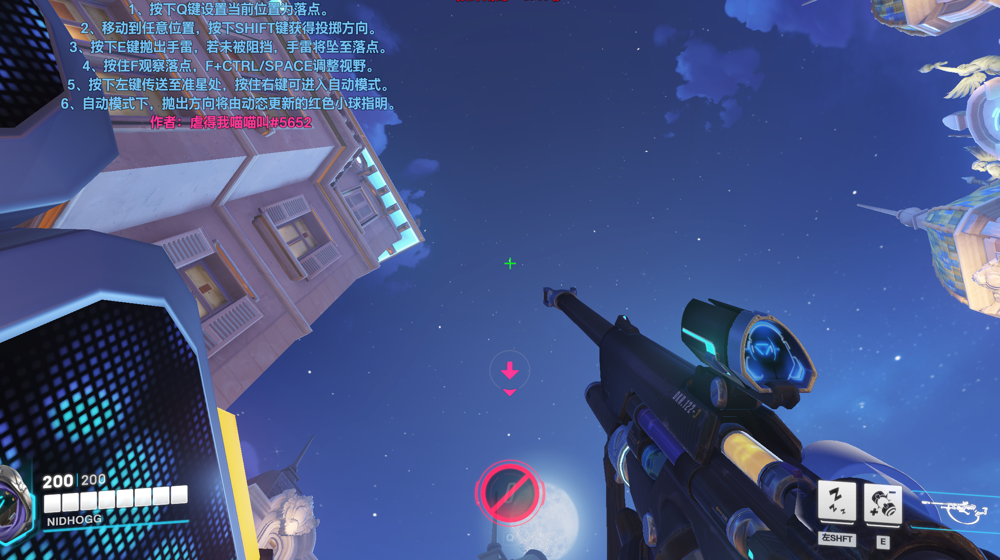

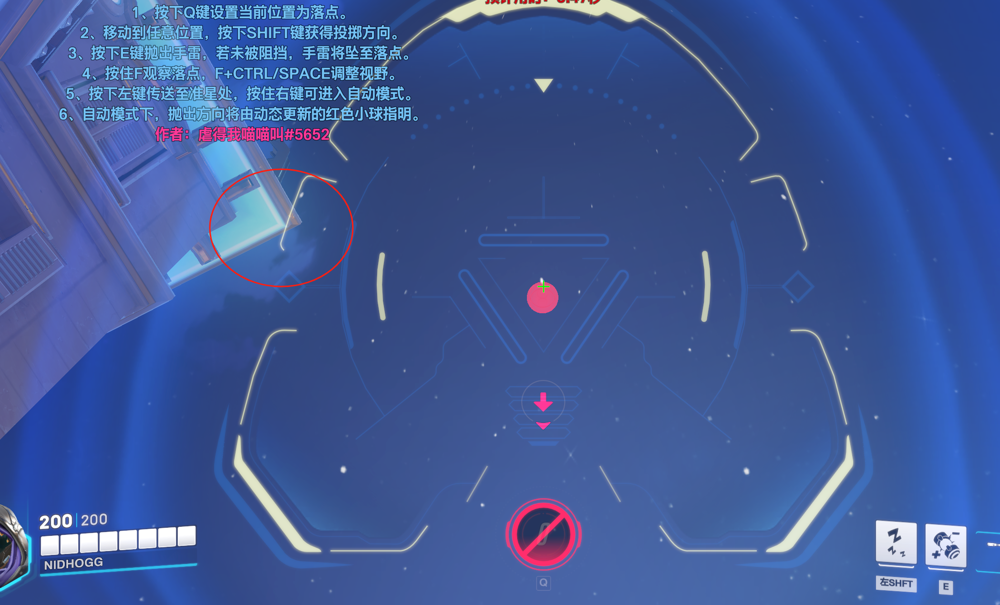

准星卡一下这个小角一边

能砸到这个位置，配合源爬墙，猩猩跳能直接收后排

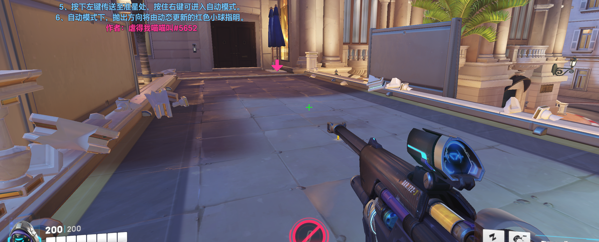

这张图阵容没确定其实说的也少，如果要拿西格玛的话，防守拿，之后带小美，如果可以的话其实可以阿三，因为这张图是长枪，大部分都会选择巴蒂和尚，安娜反而少，并且对面会抢二楼，如果能带阿三的话就集合抱团跟对面换，我们直接去打车边，但如果带的是源和半藏，只能靠半藏提前找机会，被压缩空间了，或者对不过别人就很难打，如果带阿三的话不会玩dj就巴蒂小锤，顶对面脸上打

总的来说源氏防守实在不合适，换个小美跟西格玛沟通，隔谁杀谁，这场纯属阵容问题

之后C点最后一波76上去开大没人能盯防导致被推到

进攻如果打的是猩猩的话，这张图就不带小锤，可以打安娜雾子