# w1.伊里奥斯

第一张小图，阵容选择问题+索问题

- 猩猩放狗打答辩龟点里的阵容不好打
- 索出生+输出位置受限打不出输出
- 打这套就多收过路费，也是因为索出生过路费收取不足，没有造成有效击杀被拉到点里

遇见这种情况，4人拉点抱团，一人骚扰，可以换西格玛/女王/答辩跟对面打贴脸

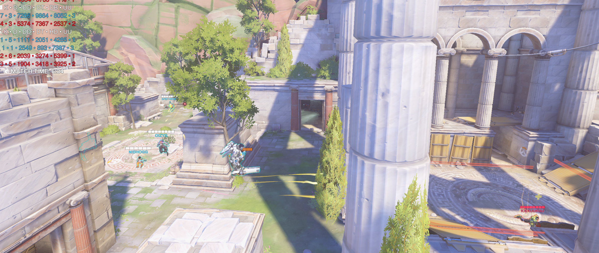

这波是落位问题，闪光和雾子的位置选择不大对，应该拉到小房间外面，内场桥上，这样视野更好，源在正面方便跟集火，闪光雾子拉侧线1可以跟集火，2雾子可以高额爆头找找机会，同时防止抱团过紧，在后排双辅交完位移技能后被一波扑掉

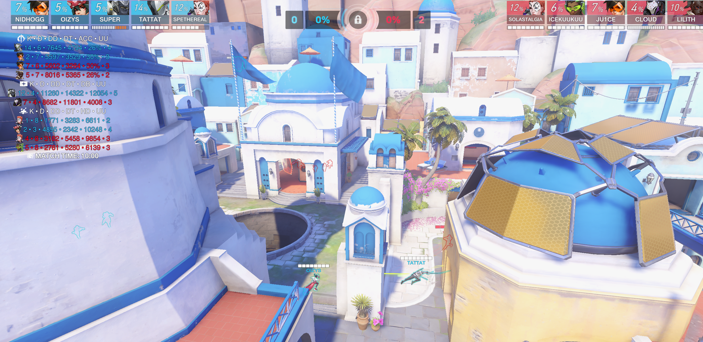

第一波，猩猩观测到对面四人抱团内场，这时候在不确定闪光是不是有位移的时候，交S去抓不大行，可以带着雾子控住他们背后二楼的高台，或者风车下高台，因为对面带的是DJ，所以在这这个口子交了位移对面是能够一波扑过来的，打放狗谨记除了跟集火的时候，铺开枪线和落位比杀人重要

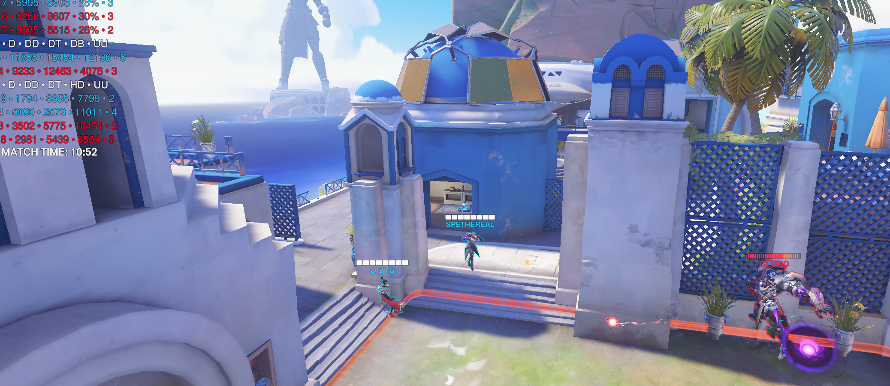

返场团，双辅是跟着猩猩从一楼拉出来的，一个有爬墙一个有飘都能一定范围内位移，最好可以走左边灯塔二楼防止被抓，这波你俩是被抓了，雾子直接tp走没问题，莫伊拉不应该往他们去的悬崖方向飘，其实可以往他他们来的方向反方向飘，因为就一波强音，反方向飘的话不会正面面对答辩，还能看看能不能跟到我们抓对面后排单线的集火

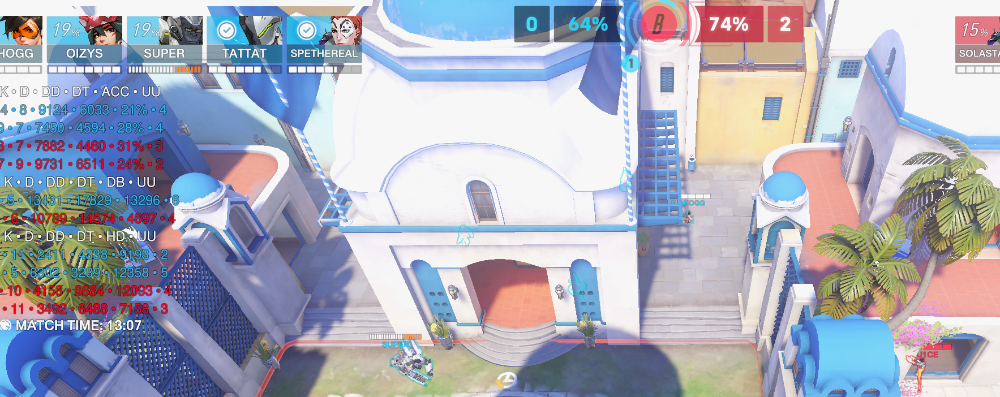

这边还是抱团抱太紧了，没有拉侧线意识，容易被交完位移后逮捕

第一次打，并且还没有细致跑图，落位细节没做到位，同时这套的不稳定性因素也很大，得想想改进办法，或者找一套更好发挥的阵容

# 2.国王大道

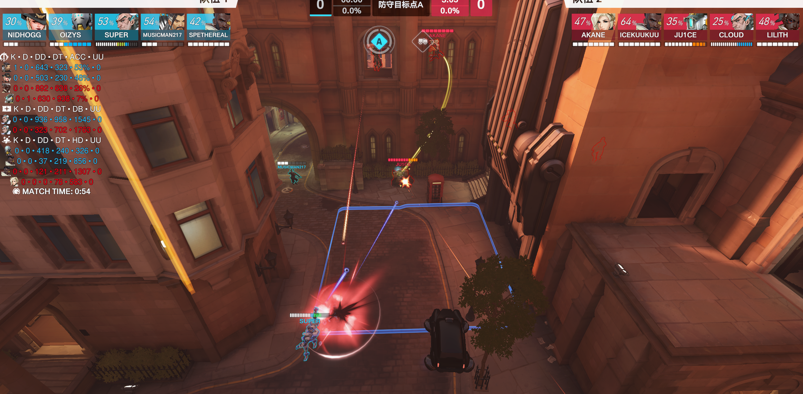

第一波拉对角的时候，半藏没有及时跟上，后面的位置很危险容易被逮捕，如果在正面的话，堡垒第一波自己一个人跳，4枪阵容挂易伤是可以直接给对面秒了的，同时没有一个c在左边看小门，和尚在打正面，巴蒂只奶也不大打输出情况下，索从小门拉出来，给后排收掉+正面压过来就没法打了

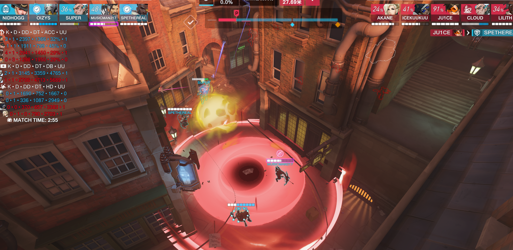

这波ash和巴蒂技能交的有问题，counter抬的话一个圣就可以了，当时打架不知道有什么技能，都是有大招的时候报一下，交技能之前说一下，这波bob和矩阵其实可以扣下来的

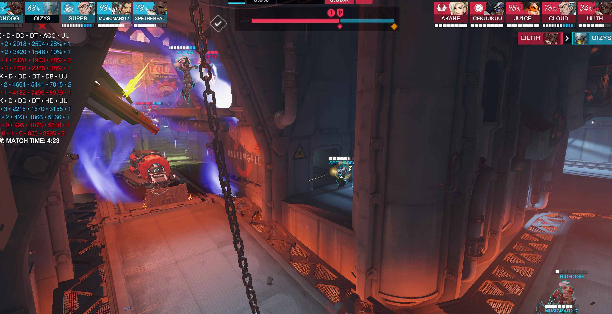

巴蒂站位没太看懂，为啥会站到那边去，之后战败团指挥车到点的车边龙也没看懂

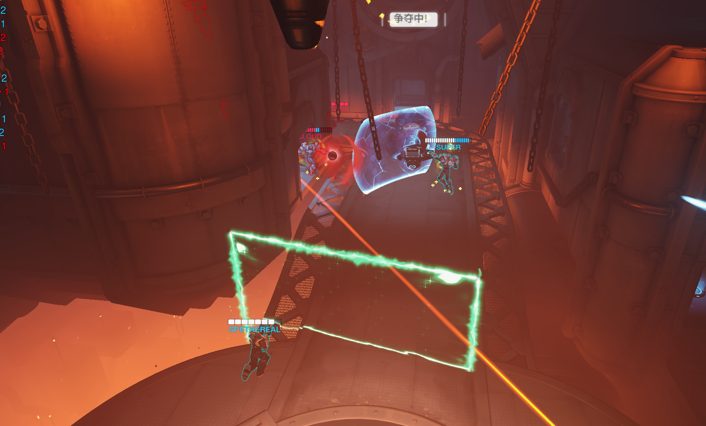

还有这个车边矩阵，什么意思呢，也不大理解

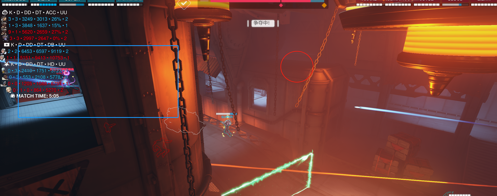

现在情况是，左边高台被卡住，并且带蓝线天使，索和尚都是上不去的，半藏有爬墙，现在应该做的事从右边高台后面上去，卡着小反斜跟对面高台的人peek，别让对面打的太舒服

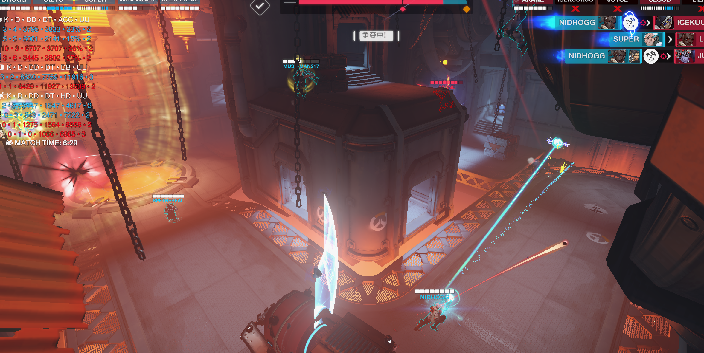

我们正面双先手大，如果后面单抬和尚在靠后位置并且有锁血的话，圣可以扣一下，交技能问题

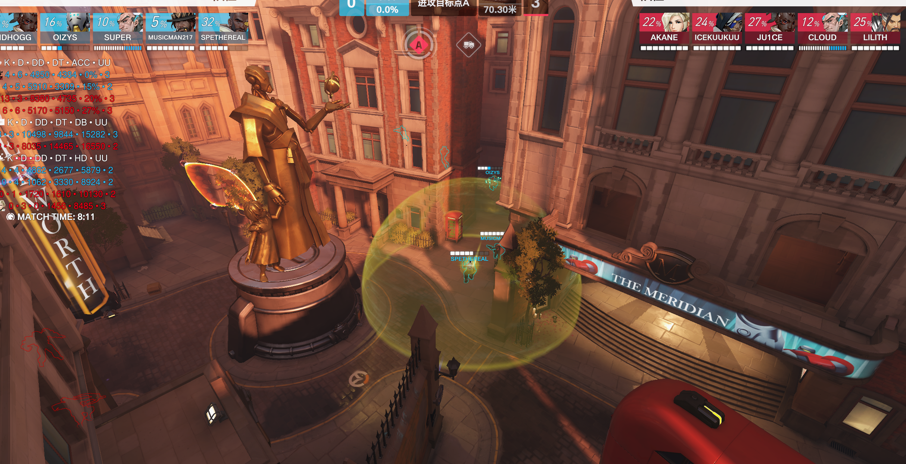

进攻出门，1忘了拿半藏百合视野抽一枪，2巴蒂拉慢了，麦克雷在这窄口贪了两枪

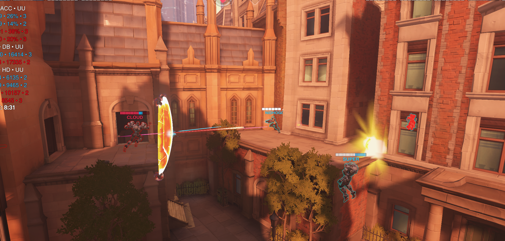

下一波是索失位，西格玛掉下去了

A点打这么久是我的问题，没有打出先手击杀，双枪太依赖先手击杀了，其实除了纯推车之外，进攻的话会不会猩猩好用一点

# 3.皇家赛道

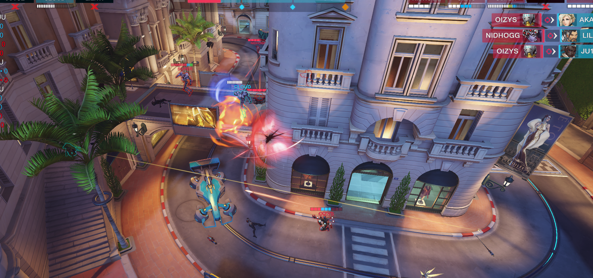

和尚杀完天使可以一个人挂后可以喊一下，让super跳下来给个盾保你，或者小房间龟一下喊人，还有下一波，安娜西格玛都在车边，巴蒂直接从高台跳下来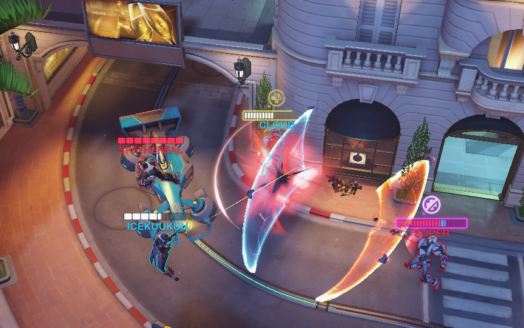

我估摸着上面也能打到，下来还是为的输出不是奶人，呆楼上就行

之后就是防守第一波，看到对面闪光就告诉你们后撤，所以都在澈，巴蒂在那蓄力往天上跳，和麦克雷两人的话交个s交个锁血肯定能走，也不知道为啥要跳

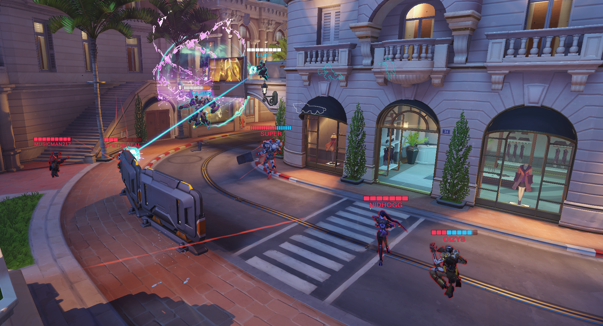

如果打皇家赛道，里阿尔托类似的这种长图，如果不拿放狗的话基本就是双长，西格玛给三枪打开点对枪空间之后靠枪打先手击杀，感觉还是有些不稳定，因为双枪比较吃状态，状态不好的话打不中人也没啥用，希望大伙集思广益，想想接下来对阵到青岛大学咱要玩啥。

最后转自老登评价：全程看了下他视角，玩巴蒂莫伊拉不知道自己在干嘛，只知道往队友旁边走，没有规避枪线和站位意识，先学学怎么走路。

在我看复盘的视角里，也看到好多暴毙的场景，我不知道看demo和pov有没有用，但是我只能说肯定没有想去学到什么东西，自己反思吧。