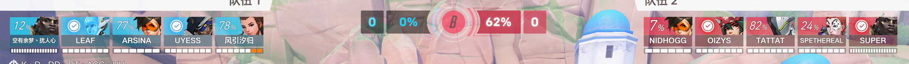
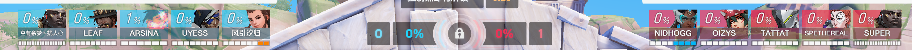
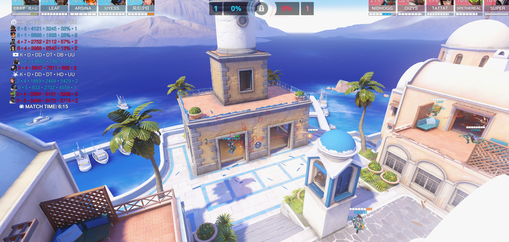
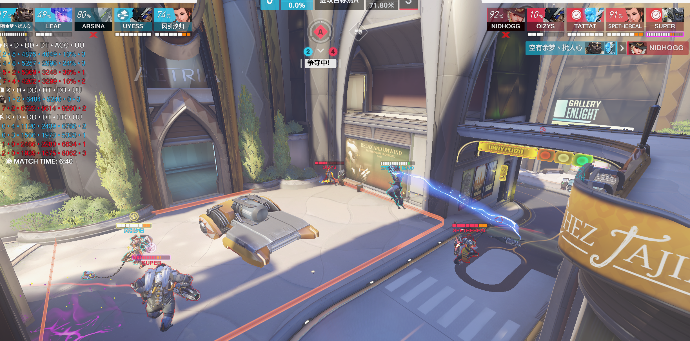
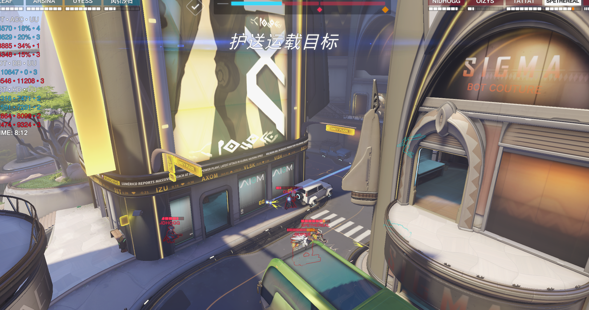
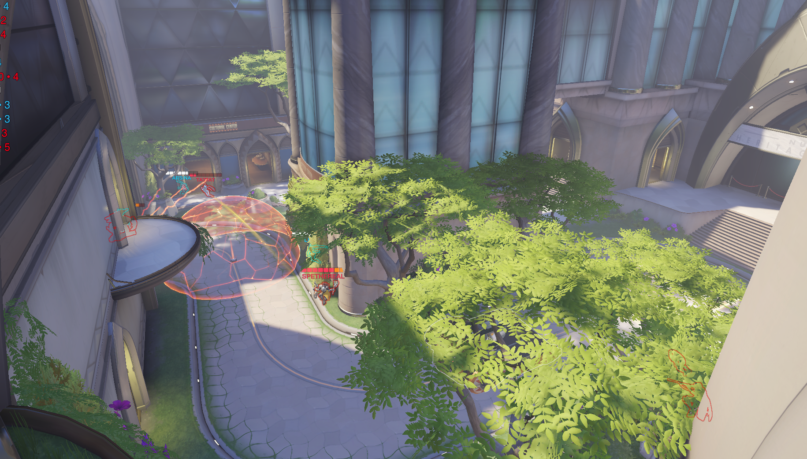

# 1.伊里奥斯

第一张图打的没啥问题，落位拉开，后排双奶勾引之后跑，等echo没飞集火echo之后再拉开找安娜小锤

第二张图对面带了长短，我们阵容在事先知道对面狗位厉害的时候，并且莫伊拉容易被抓单，就可以直接选择拿喇嘛叉冲脸阵容，对面双狗带两后排经不起我们冲的

之后对面知道莫伊拉好杀，就后面全程在针对，同时加上这张图比较长，放狗落位时间成本高+前三不够摁+对面后三抱团有保镖，所以还是带突脸阵容/长短枪比较好打

后面第三张图，刚开始是思路问题，一直龟点里确实有点幽默，这套其实只需要拉点抱团逮人就行，因为我玩的阿三，刚从闪光转换过来脑子有点懵，所以可能需要准备阶段提前讨论一下，比如传高台抓人什么的，提前确定下打法，其实还是有几波没有抱团，第一波打完就不知道该去哪，所以接下来这套多练

# 2.努巴尼

这个续点团，猩猩打的过于激进，太想杀后排了，但是我们后排脸上对面俩人，猩猩一人有大杀双辅感觉还是限制作用更多，并且就算能击杀耗费时间也很多，下次人不齐并且的点还没站下来的时候，可以先到后方等人，补下状态，因为我们返场比对面快，并且对面铁拳echo在后排脸上安娜容易被秒，如果扣招等返场的话，有bob，有拍，叠甲和变身，对面只有刀和叠甲，应该是不可能输的

这波，车到这，枪位没有对高台控制，导致echo先手击杀安娜，前点高台不打好控的情况下，是否可以从后面楼梯上去后面高台控制，交由猩猩卡车，echo关注侧翼，让奶位生存空间多点保证存活

防守最后一波，安娜和76为了保活挂太后了，76没有去侧线拉一下枪线，最后激素给出去前后排脱节过于严重

# 3.新皇后街

阵容选择，对面前二很硬后面有保镖，不大能硬跳，其实选择喇嘛叉阵容比较合适，抱团的不怕他铁拳闪光进场骚扰，打贴脸对面绝对是打不了的

