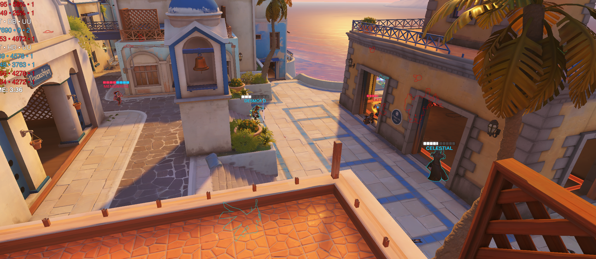
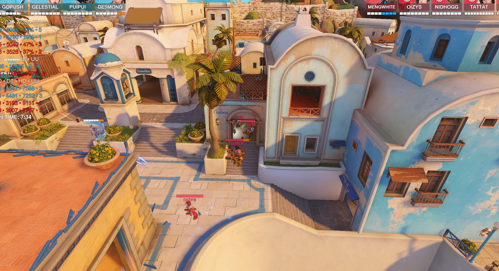

# 1.伊里奥斯

第一波近点尽量散开规避伤害，因为我们拉点快，雾子就在我视角位置爬墙奶人，其他人尽量再四个墙角规避伤害

之后还有另一种先不拉点的玩法，就是走正面直接tp他们二楼抓人

之后阿三返场，直接去找后排单挑不大行，因为对面铁拳死，我们占点，大概率小幅度后撤，等待铁拳返场，这样去找人小锤单挑就顶人脸上要吃集火，此时应该只有一种选择，传送门进点找队友抱团，由于这波又送掉，导致下一波返场团也没啥效果连死三次，纯纯4打5

这波返场团也是，对面有铁拳且知道对面小锤就在柱子后的情况下，直接拉点其实很蠢，这时候应该有两种决策，我们应该以杀人优先，首先可以二楼真tp下来冲小锤，其次可以二楼假tp，直接冲小锤，这么点距离，抱团一个强音就过去了，我们这套带阿三没有发挥阿三的强势的的点，感觉基本就是靠毛加的强度

对面铁拳有落位我们就走正面别带着走这边，一圈拳下去全地形杀了，最后这波也主要是靠我们双辅大招和毛加强度，还有对面没碰点，不然还真不一定打的下来

最后一张废墟卡位什么都还行，我玩小锤保c就行，雾子奶速度上去了，猩猩自己规避一点也保得住，阵容成熟度还是可以的，但不过国王大道就不大好拿雾子。

# 2.国王大道

这张图要tp是我有点想当然了，tp前第一波没有做位置观测直接往那里走吃禁疗确实不大行，之后也是先狙和半藏探测箭看一下狙一枪，做好观测再看往哪tp

这个A点也是有两种打法，主要围绕tp真假tp，可以真tp上二楼抓人，也可以假tp走小房间加速抓人

这波打的时候也说了，沟通没做好，车到这个地方也是两种，一种tp左边窗口，第二tp右边二楼

之后最后一个点要是大招交的差不多感觉我们就可以变阵了，打我们比较熟悉的索+源猩猩长短枪，因为这套冲脸选出来是因为前两段高台可以通过拉扯，走楼梯上去的小高台，但是c点是只能技能上去，所以，之后要是一波没打下来的话，咱就变阵，打长短运营一波激素刀什么的

A点第一波我盾击失误，高台不能放，那位置放了我们空间就会被压缩，之后被压到小门的时候也是我盾击失误，没撞到铁拳失位了，感觉还是带个安娜好点，雾子在对冲好用点，安娜能多给猩猩资源

中间b点双奶掉了其他三个人除了猩猩退太慢了，都快到家门口还被人收俩

这边开大也是我失位了，其实应该盾击回来的，卡个拐角等打就打过了，那时候被往前锤了一点就想着开大比较硬着急去顶麦克雷了，没注意到大家位置和对面这么多技能，我的问题，我小锤有时候比较激进，大伙要是看我站位太靠前，有时候估计得大声喊我一下

# 3.印度图

super第一次玩毛加，大招交的可能有点呲，就说他的大招，在外面的敌人是没法打到和奶到大招里面的人的，而且好像里面也打不到外面，所以有大的时候可以强开铁拳，，逼对面进来，之后E可能得捏死一点。

最后两个点我们返场路线选择有问题，带这个就要少被收过路费，所以禁疗选掩体多一点的口子返场，之后需要绕的时候得跟他们绕一下

因为我们是打集火阵容，所以能抓人就少交大，最后一个点灵狐先开我们五人抓落单安娜就没必要再开转，之后因为最后一波，我们还是得卡前点，先收后排，我们这套一定得开先手，不然等对面拉开阵线我们反打会比较吃力