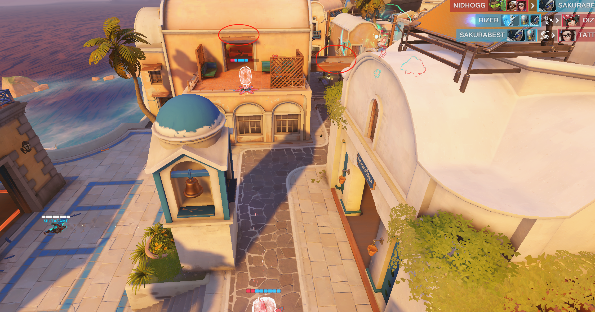

# （大伙对复盘有啥意见建议都可以gitee里面issue说或者群里说，大伙一起讨论，最近事情比较多，而且自己上场在打，有可能对复盘这一块有的时候写不大清楚，希望大伙多多担待指正）

# 1.伊里奥斯

看了下这两天录像，其实感觉开点之前直接拉点好像不大行，容易吃高台伤害还有各种poke，规避伤害也差点意思，所以今晚训练赛，到灯塔就尝试着不拉点打，先上二楼，看对面位置，之后卡视野打tp提速对面二楼，逼对面踩点，给二楼请了之后，到点里隔冰墙打针对

之后这波tp抓人，看到安娜的尽量避免正面tp，可以tp这俩红圈位置，这俩位在都是能tp到的，并且能好一点规避正面的伤害

除了这波问题大点之外，其他感觉更多是技能和交流的问题，今天毛加整体感受是没大招打到逼对面厉害，大招团就不大行

遗迹这张图1个是刚开始阵容没变，节奏没起来不大好打，2是经常在先手掉人，比如被对面索抽死或者是骚扰后排的时候太激进被反杀等等

如果长图我们拿猩猩阵容，**猩猩一定会是抗压位，帮我们吃各种技能，之后就需要双c发挥了**，这张地图super猩猩被针对的恨死，禁疗粘弹毛加全在脸上，闪光加强了但是也是尽量起一个占位置，高台或者中近距离的骚扰作用，之后是补伤害打集火，尝试杀后排的时候一定留一两段闪，被打残迅速拉开；之后在猩猩被针对这么惨情况下，索一定要打先手击杀，像对面带的和尚安娜并且站位激进，应该比较好做先手击杀。

同时后排带的是安娜小锤，拉开速度慢，对面echo毛加硬冲，保不太住安娜，所以我小锤有时候玩的就喜欢顶前点，阵容还可以再考虑下。

第三张图深井的阵容选择我觉得还是可以的，莫伊拉可以优化下，因为在这种打毛加的时候，莫伊拉比较鸡肋，并且容易被对面狗位针对，并且对面带的是雾子dj，冲脸阵容，总得有个目标之后一起交技能来冲，所以对这种阵容，我觉得吧有个得来卖破绽的人存在，之后你们前面4个机动性高的才能在对面没技能情况下抓人打集火，并且我小锤面对闪光也容易保活一点

再其他的就是闪光和源氏位置有点重合，没人去拉外场高台，都走在一起的，观测角度比较受限

# 2.直布罗陀

首先阵容选择，这张图索其实不大好发挥，能ash尽量ash，否则索只能作为一个被开的位置，需要吃很多资源，但是在高低台地图也抽不掉人，如果ash熟练度不行的话我可以出ash，萌白补个小锤，因为带索等待缘故，很多地方比较不大好控制，没有抢位上高台手段

小锤这把没开麦可能中途按到了，应该多跟安娜走一起

打防守的时候是小锤失误太多，误触一个盾击下去了，全责！

其他的除了狙好像没什么声音之外其他没说啥问题

# 3.埃斯佩兰萨

和国王大道一样，我们经常有个问题，就是有时候会顶着对面毛加的e去冲毛加，还有毛加的s常常用来冲第一波。

我觉得这套和喇嘛叉不一样，喇嘛叉追求的是dj加速一波突完后排，我们打的毛加应该是冲脸之后跟对面比生存和集火能力，不是一波就得把技能交玩，今晚打的时候试一试，分两段冲，先是dj强音加速五人抱团拉近点逼掉对面的位移技能，之后还是开着加速毛加s冲后排没技能的人，不过这样的话可能对于我们的选位和另一个辅助压力会有点大

或者是毛加S先手用来赶人，之后等S cd再强音抓人

dj还是有些不熟练，前面两波音障交的都有问题。

最后对新皇后街，对面站位拉散我们就不好打，并且每次冲的时候有点耿直，就是正面没看人位置，直接就说要冲了+大招团不如对面运营的好。