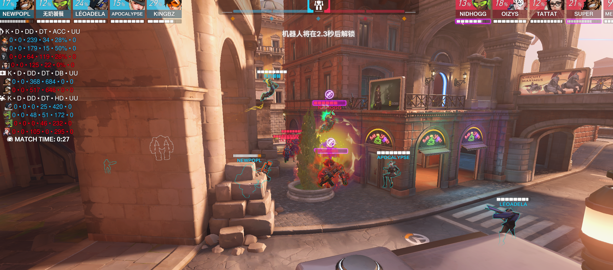
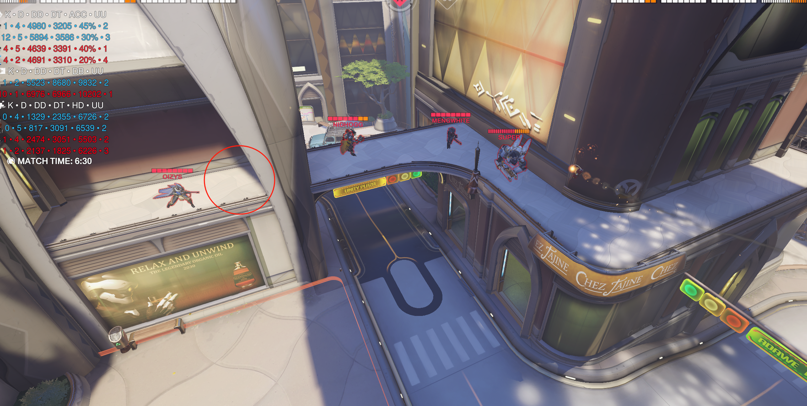
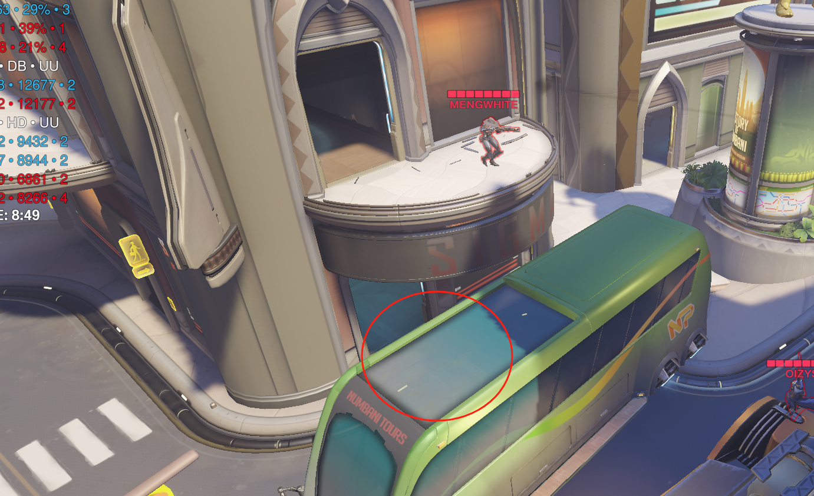
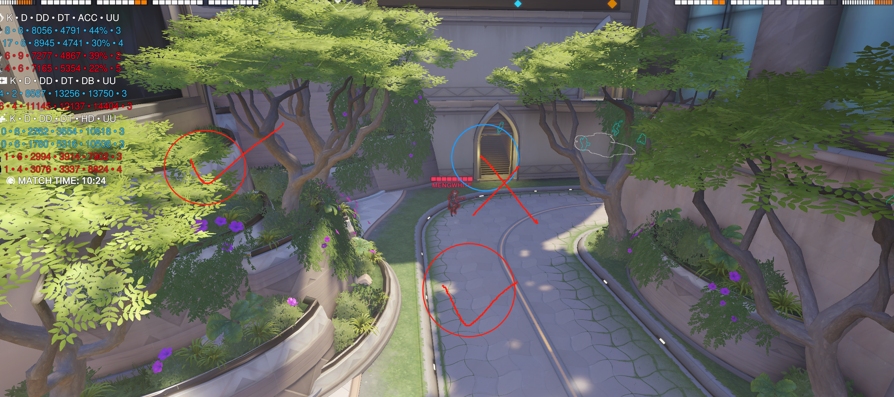

# 1.伊里奥斯

遗迹没什么好说的，拉扯开挺好打

深井的问题，我比较天真以为小锤单人能拉扯抗住正面压力，结果好像直接烂了，导致后面换了安娜跟不上集火，其实如果要打这一套的话我还得是换个类似莫伊拉一样不容易死的能跟伤害的英雄，并且对面后三抱的很死，猩猩比起铁拳来说更吃资源，阵容有点天然劣势了，不知道今天对面啥阵容，如果地推阵的话，感觉还是拿毛加拉内场，跟对面打冲脸一波的

灯塔第一波有错，我的的意思是不去二楼，拉内场tp对面二楼，因为我们这种短腿阵容如果上二楼会吃很多aoe，容易暴毙，总归还是要回到点里打，那咱不如直接强音小房间拉点

tp点位也是我想错了，因为自己试验的时候一个人tp上去没问题，人多了就容易被卡位

为我们冲人之前一定要先交流下技能，强音，冰墙，减伤都得有，才能保证我们冲完一波不会减员

主要问题出在我dj身上，我昨天确实这张图玩的一股异味

# 2.斗兽场

对面带安娜的情况还是带个雾子好点，其次第一波选错对象，对面双奶挂后带dj，跟我们打保后排拉扯，并且对面带的闪光不在正面，我们我应该可以开减伤强吃前排，再慢慢收后排的人

冰墙有点幽默，我们冲到前面了四个人再面前隔了后面，隔毛加即可

我们这套其实打的可以的，就是中间一波我迟疑交音障断了节奏就不好打了

后面也是因为变阵了没有那么大的威慑力，给不到echo资源，才会输

# 3.努巴尼

打这套我们猩猩安娜厉害直接正面，禁疗强吃，出门echo就不用tp了吧，感觉来抢位置还慢，我考虑不周了

防守的时候，ash对枪对死好几次

第一波s交完就该回到红圈甚至更靠后的位置，给压力就行，不一定要正面直接对

之后我小锤盾击想去前点，之后差了点距离没过去失位了

对TAT这边，如果感觉玩的不舒服直接换，这张图闪光源echo都能用

这边推荐站车上，对面狗阵容，车上能用短喷位移去到的地方更多更好后撤，有拉扯到后面高台的空间

c点同样的站位问题

其他的就是最后一波小锤站盾里面跟人对打，失智行为

# 4.皇家赛道

就是车到中间过不去的时候，该拉外场就得拉外场，除此之外还看c位个人状态，昨天两个人玩狙都有点梦游